# Sprixe : Chronique de développement avec Claude

> Mémento exhaustif du développement d'un émulateur CPS1 (puis Neo-Geo) from scratch dans le browser, en pair-programming avec Claude. Destiné à servir de matière première pour un article de blog. À compléter au fil de l'eau.

---

## Le pitch

Un émulateur Capcom Play System 1 (l'arcade de Street Fighter II, Final Fight, Cadillacs and Dinosaurs...) écrit entièrement en TypeScript, qui tourne dans un navigateur. Zéro dépendance d'émulation. 18 500+ lignes de code. Du boot au gameplay jouable en 5 jours.

Et l'idée folle : un renderer DOM où **chaque sprite est un `<div>`**, le jeu tourne dans les DevTools.

Puis le grand saut : **Neo-Geo** (SNK, 1990). Un second systeme arcade, une architecture radicalement differente, emule dans le meme projet. De zero a Ninja Combat jouable en 2 jours.

---

## Timeline

| Jour | Date | Commits | Résumé |
|------|------|---------|--------|
| J1 | 17 mars 2026 | 22 | Du master plan au jeu jouable — CPU, vidéo, audio, input |
| J2 | 18 mars 2026 | 36 | Audio Nuked OPM, WASM, multi-jeu, UI complète, mobile |
| J3 | 19 mars 2026 | 22 | DOM renderer, React puis vanilla, tests Tom Harte |
| J4 | 20 mars 2026 | 19 | QSound, Kabuki, TATE mode, batch OPM |
| J5 | 21 mars 2026 | 1 (squashé) | QSound audio fonctionne ! Bug Z80 préfixe opcode trouvé via MAME debugger |
| J6 | 25 mars 2026 | ~15 | Sprite Pixel Editor, audio timeline, FM Patch Editor, mic recording, palette ROM patching |
| J7 | 26 mars 2026 | ~15 | Sprite Analyzer, Sprite Sheet Viewer, photo import scroll layers, UI overhaul |
| J8 | 30 mars 2026 | ~20 | Le pivot Aseprite — audit, refactoring massif, suppression photo, palette snapshot, tests E2E |
| J9 | 2 avril 2026 | ~18 | CI Claude, landing rebuild, game matrix, beta.1, 103 unit tests |
| J10 | 3 avril 2026 | ~9 | Multi-tile sprites, mono-palette capture, palette ROM patching |
| J11 | 4 avril 2026 | ~13 | Layout refactor, Aseprite grid alignment, beta gate, center-bottom alignment |
| J12 | 5 avril 2026 | ~14 | M68000 flags booleans, 3.5K dead code, CSS -25%, perf audit (~22% CPU) |
| J13 | 6 avril 2026 | ~22 | Rebrand Sprixe, 1.0.0, COOP/COEP headers x5, PixelLab AI |
| J14 | 9 avril 2026 | ~25 | Le grand saut Neo-Geo — MVP 14 700 LOC, BIOS boot, pd4990a RTC, tile decode |
| J15 | 10 avril 2026 | ~12 | Du premier jeu jouable aux raster effects — couleurs, zoom, scanline slicing |
| J16 | 11 avril 2026 | ~6 | VRAM pointers, MVS inputs, P-ROM banking — KOF97 boot |
| **Total** | **16 jours** | **~260 commits** | **~37 000+ lignes TS+C** |

---

## Jour 1 — Du néant au jeu jouable (17 mars)

### Le premier commit : 8 900 lignes d'un coup

Le projet démarre par un commit massif : `feat: CPS1 emulator running Street Fighter II in the browser`. Claude génère en une seule passe :
- **M68000** — interpréteur cycle-accurate (2 937 lignes), 56+ instructions, 12 modes d'adressage, pipeline prefetch
- **Z80** — interpréteur complet avec préfixes CB/DD/FD/ED (2 220 lignes)
- **Bus mémoire** — memory map CPS1 complète (68000 + Z80), 24-bit
- **ROM loader** — parsing ZIP MAME avec interleave ROM_LOAD16_BYTE et ROM_LOAD64_WORD
- **Vidéo CPS-A/CPS-B** — 3 scroll layers + sprites, palette, layer priority
- **Canvas 2D** — renderer 384x224 avec pixel-perfect scaling
- **Input** — clavier + Gamepad API

SF2 boote, passe le POST, affiche le title screen. Les graphiques ont des artefacts.

### La cascade de bugs graphiques

Chaque fix en révèle un autre :

1. **Bank mapper manquant** — Les tiles scroll2 affichaient les mauvais graphiques. Il manquait le `gfxrom_bank_mapper` (mapper_STF29 pour SF2) qui traduit les tile codes via le CPS1 PAL. Fix : porter la logique de MAME.

2. **Pixel order inversé** — Le texte et les sprites étaient mirrorés horizontalement. Le décodage des pixels GFX ROM était LSB-first au lieu de MSB-first (bit 7 = pixel le plus à gauche). Un sub-agent avait même tenté de "corriger" vers LSB à un moment, ce qui garblait tout — revert nécessaire.

3. **Transparent pen** — Pen 0 était marqué transparent au lieu de pen 15. Résultat : des trous dans les sprites là où il y avait du noir opaque.

4. **CPS-B ID register** — Sans l'ID register correct (SF2 CPS_B_11 = 0x0401 à l'offset 0x32), le jeu tombait dans une boucle d'erreur après le POST. Un registre de protection anti-piratage qui bloquait tout.

5. **Plane bit order** — `decodeRow()` assignait les planes dans le mauvais ordre. MAME planeoffset {24,16,8,0} signifie byte[3]=plane0(bit0), byte[0]=plane3(bit3). L'inversion causait des artefacts de couleur rouge sur les portraits.

6. **Sprite format** — L'ordre des words dans la table sprites était faux (X, Y, code, attributes — pas code, Y, X, attr). Découvert en lisant MAME mot à mot.

7. **Sprite bank mapping** — Le bank mapping était appliqué au tile code de base, puis l'arithmétique multi-tile faite sur le code mappé. MAME fait l'inverse : arithmétique sur le code brut, puis bank-map chaque sub-tile individuellement.

### L'audio : du silence au son

L'audio a été un combat en plusieurs rounds :

**Round 1 — Mauvaise memory map Z80** : Les adresses YM2151 et OKI6295 étaient inversées (YM2151 à 0xF006 au lieu de 0xF000, OKI à 0xF000 au lieu de 0xF002). Le Z80 écrivait ses registres audio dans le vide.

**Round 2 — Timers non interleaved** : Les timers YM2151 n'avançaient qu'après la fin du budget Z80 par frame. Le driver son de SF2 dépend des Timer A IRQ pour séquencer la musique. Sans interruption pendant l'exécution Z80, le séquenceur restait bloqué. Fix : interleaver `ym2151.tickTimers()` toutes les 64 T-states Z80.

**Round 3 — Sound latch** : Confusion entre IRQ-driven et polling. MAME confirme que seul le YM2151 drive le Z80 INT. Le sound latch est pollé par la routine Timer A ISR, pas par IRQ. Un IRQ spurious sur chaque écriture du latch perturbait le séquenceur.

**Commit pivot : `e003189` — "AUDIO WORKS"** — Le moment où le premier son reconnaissable sort des haut-parleurs.

### Les inputs : dernier kilomètre

Deux bugs séquentiels :
- Start 1 était mappé au bit 2 au lieu du bit 4 dans IN0
- Les bytes joueur étaient inversés (big-endian : P1 à l'octet impair 0x800001, P2 à l'octet pair)

**Commit pivot : `b3f9dfb` — "GAME IS PLAYABLE"** — Coin, Start, mouvement, attaques — SF2 jouable de bout en bout.

---

## Jour 2 — L'audio parfait et le multi-jeu (18 mars)

### L'odyssée du YM2151

Le son marchait mais ne sonnait pas "bien". S'ensuit une série de corrections de plus en plus fines :

1. **Busy flag 64x trop long** — `busyCycles = 64` décrementé une fois par tick timer (tous les 64 clocks Z80) = 4 096 cycles de busy. Le Z80 busy-wait sur ce flag avant chaque écriture YM → il passait ~80% de son temps à tourner dans le vide. Le tempo de la musique était dramatiquement trop lent.

2. **Modulation >> 1** — Tous les outputs modulateurs étaient passés bruts aux opérateurs modulés. YMFM les shift right d'1 bit. Résultat : timbres FM 2x trop agressifs/distordus.

3. **Envelope clocking** — Le compteur d'enveloppe était per-operator au lieu de global, et clocké à chaque sample au lieu de tous les 4 samples. Les enveloppes ADSR tournaient ~2x trop vite : decay et release trop courts.

4. **LFO Phase Modulation** — Complètement non-fonctionnel (le paramètre `_lfoPhase` n'était pas utilisé). Vibrato totalement absent.

### Le pivot Nuked OPM

Après 4 corrections incrémentales du YM2151, décision de pivoter vers **Nuked OPM** — une émulation transistor-level du YM2151 basée sur le decap du chip (die shots). Port de 2 000+ lignes de C vers TypeScript.

**Bug critique du port** : `~level & 0xffff` — Le NOT signé en C préserve le signe pour le shift arithmétique `>> 5`. En TypeScript, le masque `& 0xffff` convertissait le résultat signé en unsigned 16-bit, causant l'inversion de la courbe d'attaque des enveloppes. Les canaux restaient coincés à atténuation maximale (silencieux). Fix : retirer le masque `& 0xffff`.

### De TypeScript à WASM

Le port TS de Nuked OPM marchait mais consommait ~58% CPU. Décision de compiler le C original vers WASM via Emscripten. Résultat : **25% de réduction CPU** (33% vs 58%). Le hot loop `clockCycles` bénéficie directement des optimisations natives.

### L'OKI6295 : trois tentatives

Le décodeur ADPCM OKI6295 a nécessité trois réécritures :

1. **Protocole inversé** — Bit 7 set = phrase select (pas stop). Bit 7 clear = stop (pas select). L'inverse de la première implémentation.
2. **Adresses nibble vs byte** — La phrase table contenait des adresses byte, pas nibble. Lecture aux mauvaises positions ROM.
3. **Normalisation** — Diviseur 8 192 (trop silencieux) → 1 024 avec volumes entiers (16x trop fort) → 2 048 avec volumes float (correct, matching MAME `stream.add_int(..., 2048)`).

### Multi-jeu et catalogue

Passage de SF2-only à 41 jeux supportés :
- Architecture CPS-B configurable par jeu (ID, layer control, priority masks, palette control)
- GFX mapper par jeu (remplacement du mapper_STF29 hardcodé)
- 245 jeux dans le catalogue (source MAME 0.286)
- ROM loading depuis fichiers locaux

### Le fullscreen : 4 commits pour un feature

La séquence `1ef18bc` → `b951efa` → `ba528bb` → `040d7dc` illustre bien le tâtonnement typique avec les APIs browser :
1. Le fullscreen ne stretch pas → fix CSS
2. Vendor prefix manquant → ajout webkitRequestFullscreen
3. Fullscreen sur le wrapper au lieu du canvas → switch
4. Audio suspendu au retour → resume

### L'audio dans le browser : user gesture hell

Le browser bloque la création d'AudioContext hors d'un geste utilisateur. Trois commits pour résoudre :
1. `initAudio` appelé après le download async → bloqué
2. Déplacé dans le click handler → fonctionne mais worklet pas prêt
3. Split : création AudioContext synchrone dans le click, setup worklet async mais awaité avant le premier frame

Le `SharedArrayBuffer` nécessite des headers COOP/COEP. Sans eux, fallback ScriptProcessorNode (main thread) → crackling audio permanent. Fix : ajouter les headers dans la config Vite.

---

## Jour 3 — Le DOM renderer et la rigueur des tests (19 mars)

### L'idée folle : chaque sprite est un `<div>`

Le MASTER-PLAN décrit la vision : réinterpréter le hardware graphique CPS1 à travers les primitives du web. Chaque sprite est un `<div>`, chaque tile un élément DOM, le jeu "tourne dans les DevTools".

**Première implémentation : React** — Composants `<ScrollLayer>`, `<Tile>`, `<Sprite>` avec sprite sheets en blob URL. Le concept fonctionne mais React est over-engineered pour 60fps de mise à jour DOM brute.

**Pivot : vanilla TypeScript** — React supprimé (`d93dd8a`). Le renderer DOM est réécrit en vanilla TS avec manipulation directe du DOM. Plus léger, plus prévisible, pas de diffing virtuel inutile pour du contenu qui change intégralement chaque frame.

**Pivot #2 : hybrid renderer** — Les scroll layers en canvas (trop de tiles pour le DOM), les sprites en DOM. Meilleur des deux mondes : les sprites sont inspectables dans DevTools, les backgrounds performants.

### Bugs du DOM renderer

- **Palette hash** — Le cache de sprite sheets ne détectait pas les changements de palette. Sprites avec les couleurs du frame précédent.
- **Layer order CPS-B** — Les sprites doivent être sandwichés entre les scroll layers selon la priorité CPS-B, pas toujours au-dessus.
- **Tilemap wrapping** — Les tiles de scroll layers doivent être positionnées en espace écran, pas en espace tilemap.

### Tom Harte : la validation hardware

Intégration des vecteurs de test Tom Harte pour le M68000 et SingleStepTests pour le Z80 :

**M68000** : 84 groupes d'instructions, 200 vecteurs chacun. Chaque vecteur contient l'état CPU initial, la mémoire, et l'état attendu après exécution. Bugs trouvés et corrigés :
- ASR avec grand compteur : flags incorrects
- Plusieurs bugs de calcul d'adresse effective
- Address Error frame : l'adresse 32-bit complète doit être dans le frame d'exception

**Z80** : 588 groupes d'instructions (base + CB + ED), 200 vecteurs chacun. 565 passent 200/200. Les 23 échecs restants :
- Flags undocumented (bits 3, 5) de SCF/CCF et BIT b,(HL)
- Block I/O : calcul de flags complexe non implémenté
- HALT : gestion dans le setup de test

### Bug YM2151 IRQ clear

`6afbb34` — L'IRQ clear du YM2151 n'était jamais détecté après écriture registre. Le timer IRQ restait actif indéfiniment, bloquant les futurs IRQ. Le séquenceur musical se désynchronisait progressivement.

---

## Jour 4 — QSound, Kabuki et le hardware exotique (20 mars)

### QSound : un DSP dans l'arcade

Les jeux CPS1.5/CPS2 (Dino, Punisher, Slam Masters...) utilisent un chip QSound (DSP custom) au lieu du YM2151. Architecture radicalement différente :
- DSP séparé avec sa propre ROM de programme (`dl-1425.bin`)
- Communication Z80 → QSound via registres mappés en mémoire
- Audio surround avec spatialisation

**Approche** : Port WASM de l'implémentation HLE (High-Level Emulation) de MAME. Le DSP n'est pas émulé cycle-accurate mais fonctionnellement.

### Kabuki : le Z80 chiffré

Découverte que les jeux QSound utilisent un **Kabuki Z80** — un Z80 custom avec déchiffrement des opcodes intégré. Sans la clé de déchiffrement, le Z80 exécute du garbage.

Chaque jeu a une clé unique (swap_key1, swap_key2, addr_key, xor_key). Implémentation du déchiffrement → tous les jeux QSound bootent.

### TATE mode

Pour les jeux verticaux (1941, Varth, Mercs...), auto-rotation CSS du canvas à 90°. Détection automatique via les métadonnées du jeu.

### Dino boots : la séquence de debug

`84c6ea3` — Pour faire booter Cadillacs and Dinosaurs :
- **QSound handshake** — Le 68000 attend une réponse du DSP QSound au démarrage
- **EEPROM stubs** — Le jeu lit/écrit une EEPROM série 93C46 pour les paramètres opérateur
- **Z80 pre-run** — Le Z80 doit tourner quelques frames avant que le 68000 ne commence

### Batch OPM clocking

`cf90be5` — Optimisation : au lieu d'appeler le WASM clock-par-clock (~30K appels JS→WASM par frame), on batch les clocks. Réduction significative de l'overhead d'appel inter-language.

---

## Jour 5 — De "pas de son" à "ça marche l'ami" (21 mars)

### La chasse au bug QSound : 12 heures de debug

Session marathon de debugging de l'audio QSound. Le pipeline était silencieux malgré tout étant en place. Chronologie de la chasse :

1. **Pipeline vérifié** — Le QSound DSP HLE produit du son en écrivant les registres directement (bypass). Le problème est côté Z80.
2. **EEPROM 93C46** — Implémentation du protocole série (CS/CLK/DI/DO). Sans EEPROM, le 68K ne génère pas de commandes son (le jeu est en mode "factory reset").
3. **Interleave CPU** — Passage de l'exécution séquentielle (68K puis Z80) à l'interleave par scanline (comme MAME). Le 68K et le Z80 voient les écritures shared RAM en temps réel.
4. **Wake hack** — Tentative de réveiller le Z80 quand le 68K poste une commande. Le Z80 se réveille mais efface tout (code de clear). L'ISR n'a pas le temps de capturer la commande.
5. **Le bypass direct** — Écriture directe des registres QSound quand le 68K envoie une commande → du son ! Le pipeline DSP fonctionne de bout en bout.
6. **Traçage Z80** — Le Z80 atteint la subroutine QSound write (0x0A1B) 6000+ fois, mais DE=0x0000 pour tous les paramètres de voix.

### Le coup de grâce : MAME debugger

Après des heures de traçage manuel, l'utilisateur propose d'utiliser MAME en mode debug. **En 2 minutes**, la comparaison des traces révèle le bug :

```
MAME:  0001: im   1     ← Mode d'interruption 1
Notre: 0001: im   0     ← Mode d'interruption 0 (!!)
```

**Cause racine** : les instructions Z80 préfixées (CB, ED, DD, FD) lisaient le second byte d'opcode depuis la **DATA ROM** au lieu de l'**OPCODE ROM**. Avec le chiffrement Kabuki (qui décode opcodes et données différemment), `ED 56` (IM 1) était décodé comme `ED 66` (IM 0, un miroir de `ED 46`).

En IM 0, le Z80 n'appelait jamais l'ISR à 0x0038. L'ISR ne capturait jamais les commandes son. Les voix QSound n'étaient jamais configurées. Silence total.

**Fix : 3 lignes changées** — `fetchByte()` → `fetchOpcode()` dans `execCB()`, `execED()`, `execDDFD()`.

### Leçon

> On a passé 12 heures à tracer manuellement le Z80, tenter des hacks (wake, bypass, force ready flag), instrumenter chaque étape du pipeline. Le bug était un `fetchByte` au lieu de `fetchOpcode` dans 3 méthodes. MAME debugger l'a trouvé en 2 minutes en comparant la trace de boot.

---

## Jour 6 — L'editeur graphique prend forme (25 mars)

### Le Sprite Pixel Editor : une premiere mondiale

La session du matin attaque le chantier le plus ambitieux depuis le rendu video : l'edition de sprites **en temps reel**, dans un jeu CPS1 qui tourne. Aucun emulateur au monde ne propose ca — les outils de romhacking existants (YY-CHR, TilEd) travaillent offline sur des ROMs figees.

L'architecture est un empilage de couches :
- `inspectSpriteAt()` sur CPS1Video — hit-test des sprites front-to-back avec metadonnees completes (tileCode, paletteIndex, gfxRomOffset, flip, multi-tile info)
- `tile-encoder.ts` — `encodeRow()` (inverse de `decodeRow()`), `writePixel()`, `readPixel()`, `readTile()`. L'encodage 4bpp planar CPS1 est l'inverse exact du decodage qui existait deja
- `palette-editor.ts` — `readPalette()`, `writeColor()`, `encodeColor()` avec conversion lossy RGB vers CPS1 16-bit
- `sprite-editor-ui.ts` — Panneau 360px avec grille tile 16x16 zoomee, outils pencil/fill/eyedropper/eraser, sidebar palette avec color picker, navigation entre tiles voisins, undo/redo (100 niveaux), frame stepping
- Overlay canvas pour la selection de sprite — hover highlight (cyan), tile selectionne (rouge), contours multi-tile

Le systeme de **Tile Reference Counter** (`tile-refs.ts`) est une piece critique : avant d'ecrire un pixel, il faut verifier si le tile est partage par plusieurs sprites. Si oui, dupliquer le tile vers un slot libre avant d'ecrire, sinon on corromprait tous les sprites qui partagent ce tile.

### L'audio timeline et le debt-based timing

En parallele, la timeline audio recoit un ruler frame-synced avec des ticks mineurs (60 frames) et majeurs avec labels (600 frames). Le scroll est lie au `frameCount` de l'emulateur, s'arrete en pause, et va dans le sens inverse (nouvelles donnees a gauche).

Le vrai fix de cette session : **Firefox audio lag**. Le `setInterval(16.77ms)` naif ne fonctionne pas sur Firefox qui throttle les timers differemment de Chrome. Remplacement par un tick 4ms + accumulateur de dette de frames. Le Worker rattrape les frames manquees au lieu de les dropper. Le ring buffer est double de 8192 a 16384 samples (~340ms de marge).

### La soiree : FM Patch Editor — trois approches, trois echecs

L'ambition de la soiree : un editeur de patches FM. Lire les voices du driver son CPS1, modifier les parametres (ADSR, algorithme, niveaux operateurs), entendre le resultat en temps reel.

**Le parser fonctionne** — `cps1-sound-driver.ts` decode le format voice 40-byte du driver v4.x, trouve la table de voices par pointeur de base ou scan brute-force. L'UI macro avec les 4 operateurs, les enveloppes, l'algorithme — tout est la.

**Le playback echoue**. Trois approches tentees :

1. **ROM patching** — Ecrire les registres du patch directement dans la ROM du driver son. Probleme : le Z80 cache les donnees de voice en work RAM. Modifier la ROM n'a aucun effet tant que le Z80 n'a pas recharge la voice.

2. **fmOverride** — Intercepter les ecritures YM2151 dans le Worker et substituer les registres du patch. Partiellement fonctionnel mais sonne faux : le Z80 ajuste dynamiquement les TL (Total Level) pour les enveloppes de volume. Nos valeurs statiques ecrasent ces ajustements dynamiques.

3. **Shadow registers** — Maintenir un miroir des registres YM2151 et ne substituer que les parametres de timbre (DT, MUL, AR, DR, etc.) en preservant les TL du Z80. Trop de cas limites : le driver change les TL pour le volume ET le timbre (carrier vs modulator).

**Verdict** : l'onglet Synth est code mais cache dans l'UI. Le playback temps reel necessite le reverse-engineering du sequenceur musical Z80 — ajoute au backlog comme projet DAW complet.

### Mic recording et la decouverte des palettes CPS1

Le remplacement de samples OKI par enregistrement micro fonctionne du premier coup : `getUserMedia()` → buffer 3s → low-pass 3kHz → normalize → tanh soft-clip → encode ADPCM. Le traitement lo-fi donne un caractere arcade authentique.

La **palette ROM patching** revele un detail hardware meconnu : les palettes CPS1 ont un **nibble de luminosite** (brightness). Le programme 68K applique un fade de luminosite via une boucle `ADD.W D2, (A0)+` a PC=0x2A6A. La recherche de palette dans la program ROM doit stripper ce nibble avant de comparer, sinon les couleurs editees ne sont pas retrouvees apres un changement de round.

### Le YM2151 WASM et la sensibilite du address latch

Decouverte d'un comportement subtil de Nuked OPM : l'adresse du registre est latchee par `_opm_write_address`, et la donnee par `_opm_write_data`. Si on ecrit l'adresse sans ecrire de donnee, le latch reste. Si on ecrit une donnee sans avoir ecrit d'adresse, elle va au dernier registre latche. Le code du FM Patch Editor supposait des ecritures atomiques (addr+data en paire), mais le Z80 peut ecrire l'adresse, faire autre chose, puis revenir ecrire la donnee bien plus tard. Source de bugs subtils dans l'override de patches.

---

## Jour 7 — Le Sprite Sheet Viewer et la chasse au pen 15 (26 mars)

### Sprite Analyzer : regrouper ce que le hardware disperse

Le CPS1 ne connait pas les "personnages". Il n'a que des OBJ entries de 16x16 pixels dans une table VRAM. Un personnage comme Ryu dans SF2 est un assemblage de 8-12 OBJ entries positionnees en grille. Le **Sprite Analyzer** (`sprite-analyzer.ts`) reconstruit les personnages a partir des primitives :

1. **Groupement par palette** — Flood-fill sur la liste OBJ : deux sprites adjacents avec la meme palette appartiennent probablement au meme personnage
2. **Proximite spatiale** — Les sprites du meme groupe doivent etre physiquement proches (tolerance de quelques pixels pour les gaps entre tiles)
3. **Contour rouge** — Overlay de debug montrant le rectangle englobant de chaque groupe detecte
4. **Center-tracking** — Le centre du groupe est suivi frame a frame, permettant de voir le personnage bouger

### Pose Capture : enregistrer le gameplay

Le Sprite Analyzer capture les poses **pendant que le joueur joue**. A chaque frame, il assemble le personnage suivi, calcule un hash de tile codes (ignorant les miroirs — flip horizontal ne change pas la pose), et compare aux poses deja vues. Les poses uniques sont stockees dans une galerie.

La deduplication par hash est critique : sans elle, une seconde de gameplay a 60fps genererait 60 entries presque identiques. Avec, on capture typiquement 15-30 poses uniques pour un personnage (idle, marche, coups, sauts, touches, KO).

### Sprite Sheet Viewer : l'editeur plein ecran

Le viewer remplace le canvas du jeu par un editeur plein ecran. A gauche, la sidebar avec toutes les poses capturees en miniature. Au centre, le sprite zoome a 4x CSS avec la grille de tiles horizontale en dessous. Cliquer sur un tile dans le strip l'ouvre dans l'editeur pixel existant.

L'architecture est un **mode switch** : le canvas du jeu est cache (`display: none`), le viewer est affiche. L'emulateur reste en pause en arriere-plan. Le bouton "Edit sprites" dans le header permet de revenir au viewer depuis le mode jeu.

### La chasse au pen 15 : le bug le plus traitre de la session

`assembleCharacter` construisait l'image composite du personnage en assemblant les tiles individuels. Pour chaque pixel, il lisait le `colorIdx` du tile decode. **Le bug : `colorIdx === 0` etait traite comme transparent.**

Mais le hardware CPS1 utilise **pen 15** comme transparent, pas pen 0. Le renderer du jeu le sait — ligne 892 de `cps1-video.ts` : `if (colorIdx === 15) continue; // transparent pen`. Mais `assembleCharacter` dans sprite-analyzer.ts avait ete ecrit independamment, avec l'hypothese (fausse) que pen 0 = transparent.

**Symptome** : les cheveux et la ceinture de Ryu apparaissaient comme des trous noirs dans le preview du Sprite Sheet Viewer. La palette etait correcte (debug logs confirmaient les changements de couleur), mais le preview ne se mettait pas a jour. Parce que les pixels pen 0 (cheveux noirs) etaient effaces au lieu d'etre dessines.

**Fix** : 1 ligne dans `sprite-analyzer.ts` — `colorIdx === 0` → `colorIdx === 15`. Et la meme correction dans la grille de tiles du viewer.

### Photo import sur scroll layers : le combat des coordonnees

Le systeme de photo import permet de dropper une image sur un scroll layer, de la redimensionner/deplacer en overlay RGBA, puis de la merger dans les tiles GFX ROM via dithering Atkinson et quantization vers la palette CPS1 16 couleurs.

**Le premier bug majeur** : les photos "suivaient la camera". Le systeme positionnait les overlays en coordonnees ecran. Quand le joueur bougeait et que le scroll defilait, la photo restait fixe a l'ecran au lieu d'etre ancree dans le monde du jeu.

**Fix** : helper `getGroupScroll()` lisant les registres de scroll CPS-A. Toutes les interactions (click, drag, resize) sont converties en coordonnees monde. Le render de l'overlay soustrait le scroll courant pour afficher au bon endroit. Les photos restent ancrees a leur position dans le decor.

**Le Tile Allocator** (`tile-allocator.ts`) resout un probleme insidieux : sur les scroll layers, plusieurs positions de la tilemap peuvent referencer le meme tile dans la GFX ROM. Si on merge une photo sur un tile partage, on corrompt tous les endroits qui utilisent ce tile. Le Tile Allocator cree des copies privees avant le merge, avec expansion automatique de la GFX ROM si necessaire. Le reverse bank mapping pour scroll1 (interleave) est particulierement delicat.

### Les commits perdus

Deux commits (`d42971e`, `e5ad1e9`) n'avaient pas ete pushes avant le merge de la PR. Le worktree local les avait, mais la branche mergee sur GitHub ne les contenait pas. Recuperation via cherry-pick depuis les refs orphelines — un rappel que `git push` avant `gh pr merge` n'est pas optionnel.

### WAV import saturation : le boost qui n'aurait pas du etre la

`encodeSample()` appliquait un gain 1.8x + tanh soft-clip a **tous** les WAV importes. Ce traitement avait ete concu pour le micro (signal faible, besoin de boost pour matcher le "hot mastering" des samples CPS1 originaux). Mais pour un WAV deja normalise, ca saturait completement.

**Fix** : parametre `boost` optionnel (default `false`). Le boost n'est applique que pour l'enregistrement micro. Les imports WAV passent sans traitement.

### UI overhaul : les details qui comptent

La fin de session est un marathon de polish UI :
- **Tool cursors** — Curseurs canvas generes programmatiquement en PNG data URL pour chaque outil (pencil, bucket, eyedropper, eraser). Plus de curseur par defaut quand on peint.
- **Layer panel open by default** — Le panneau de layers est visible au lancement avec bouton de fermeture.
- **Hamburger menu** — "Video (F2)" toggle les deux colonnes, suppression de l'entree "Sprite Editor" redondante.
- **F2/F3 shortcuts** — Fonctionnent maintenant sans ROM chargee (les panneaux sont independants de l'etat du jeu).

---

## Jour 8 — Le pivot Aseprite et l'audit (30 mars)

### L'audit qui change tout

La session commence par une demande inhabituelle : un audit complet du codebase. Structure, best practices, decoupe, testabilite. Trois agents d'exploration paralleles scannent ~31 000 lignes de source.

Le diagnostic est sans appel :
- **`sprite-editor-ui.ts` : 4 629 lignes** — le fichier le plus gros du projet. Une seule classe avec ~10 responsabilites distinctes, 12 methodes de plus de 100 lignes, zero test unitaire.
- **`frame-state.ts`** duplique byte-for-byte 5 fonctions de `cps1-video.ts`
- **`CHAR_SIZE_16 = 128`** defini 5 fois dans 5 fichiers differents
- Constantes de timing (`PIXEL_CLOCK`, `Z80_CLOCK`) dupliquees entre `emulator.ts` et `audio-worker.ts`
- Le type `manifest: any` se propage dans toute la chaine Aseprite

### Le refactoring chirurgical

L'approche : 5 extractions atomiques, chacune validee par build + 903 tests unitaires avant la suivante.

1. **`aseprite-io.ts`** (541 LOC) — Import/export Aseprite. Le plus auto-contenu : zero state interne, pur I/O fichier. Extrait en premier pour valider la methode.

2. **`capture-session.ts`** (222 LOC) — Logique de capture sprites + scroll. Une classe `CaptureManager` qui encapsule l'etat des sessions actives. Decouverte de dead code au passage : `toggleScrollCapture` etait declare mais jamais appele.

3. **Dead code** (-320 LOC) — `importTilePng`, `processImportTilePng`, `exportCurrentTile`, `importImageOnCurrentTile` — quatre methodes d'import PNG tile-par-tile qui n'etaient appelees nulle part. Remplacees par le workflow Aseprite.

4. **`sheet-viewer.ts`** (1 115 LOC) — Le plus gros morceau. Le sprite sheet viewer et le scroll set viewer partageaient beaucoup de code (lifecycle enter/exit, rendu de tiles, tile strip). Fusionnes dans un seul module `SheetViewer` avec une interface host. Le code de rendu de tile factorise dans `renderTileToImageData`.

5. **`photo-layer-ops.ts`** (340 LOC) — Operations pures photo layer (quantize, merge, magic wand, composite). Extrait en fonctions standalone.

**Resultat intermediaire** : 4 629 → 2 355 LOC. Le fichier est passable.

### Le pivot : "Work in Aseprite, play in Sprixe"

Puis vient la revelation. L'utilisateur demande : "la drop zone photo, le capture panel, c'est elimine depuis longtemps, regarde l'historique". Le systeme photo layer — import, quantize Atkinson, merge sur tiles, magic wand, drag/resize layers — est du code mort. Le workflow a pivote vers Aseprite sans que la codebase suive.

**Suppression massive** :
- `photo-layer-ops.ts` (340 LOC) — supprime entierement
- `photo-import.ts` (854 LOC) — supprime entierement
- `magic-wand.test.ts` (245 LOC) — supprime entierement
- `PhotoLayer` type, `createLayer`, champ `layers` sur `LayerGroup` — supprimes
- Drag/resize layers sur l'overlay, head selector, quantize/merge buttons dans le sheet viewer — tout supprime
- Callbacks layer panel (`onDropPhoto`, `onQuantizeLayer`, `onMergeGroup`, etc.) — supprimes

**sprite-editor-ui.ts** : 2 355 → **1 454 LOC**. Reduction totale depuis le debut de la session : **-69%**.

Le pivot est materialise dans le code : Sprixe est un pont entre la ROM et Aseprite. On capture, on exporte, on edite dans Aseprite, on reimporte. Zero edition in-app.

### La palette fantome

Bug rapporte en live : les personnages de l'ecran de selection (Punisher) apparaissent avec des couleurs fausses — violacees, fadees. Le personnage est correct dans le jeu mais les cards et le viewer montrent une palette degradee.

**Cause racine** : la palette RGB est lue depuis la VRAM au moment du rendu, pas au moment de la capture. Sur CPS1, les palettes VRAM sont dynamiques — le jeu les reecrit a chaque frame pour les effets de fade, flash, selection. Si le jeu est pause pendant un fade, ou si l'ecran a change entre la capture et le viewer, les couleurs sont fausses.

**La discussion sur "la bonne palette"** est revelante. L'utilisateur pose la question : "au moment de la capture tu n'es pas plus sur de la palette que quand on prend celle de la VRAM, il n'y a pas de bonne palette". C'est vrai — un snapshot isole n'est pas plus fiable qu'un autre. Mais l'utilisateur tranche pragmatiquement : "il suffit de REC au bon moment et basta".

**Fix scroll** : `captureScrollFrame` snapshote les 16 couleurs RGB lors de la premiere rencontre de chaque palette index. Le `ScrollSet` embarque le `capturedColors` utilise par le viewer et l'export Aseprite, avec fallback VRAM pour les anciennes captures.

**Fix sprite** : meme approche — `CapturedPose.capturedColors` stocke la palette au moment de `capturePose`. Le sheet viewer, le tile grid, et l'export Aseprite utilisent cette palette snapshotee.

### Les tests E2E : 226 echecs

En voulant valider les changements, decouverte que les tests E2E Playwright sont entierement casses. Pas a cause du refactoring — ils l'etaient deja. La cause racine : `page.goto('/')` pointait vers la **landing page** (`index.html`) au lieu de l'app (`/play/index.html`). Les tests referençaient aussi des elements DOM supprimes depuis longtemps (hamburger menu, tool buttons, undo/redo).

**Reecriture complete** : 16 fichiers de specs, ~115 tests. Chaque selecteur verifie contre le DOM actuel. Ajout d'une spec 16 dediee au workflow REC → cards → sheet → close (17 tests).

Un bug subtil dans le helper `loadTestRom` : `waitForSelector('#drop-zone.hidden')` attendait un element **visible** — mais l'element avec `.hidden` a `display: none`. Fix : `state: 'attached'` au lieu de `state: 'visible'`.

### L'auto-save : le prompt qui ment

Bug UX : "Modifications non sauvegardees trouvees" s'affiche alors qu'il n'y a aucune modification. L'auto-save cree une entree IndexedDB vide au chargement du jeu (un `onModified` spurious). Le prompt s'affiche des qu'une entree existe, sans verifier le contenu.

**Fix** : parser le JSON de l'auto-save avant d'afficher le prompt. Compter les diffs (graphics, program, OKI) et les poses. Si tout est vide, ne pas afficher. Sinon, montrer un resume : "3 tiles · 1 palette · 2 poses". Le wording passe de "Modifications non sauvegardees trouvees" a "Sauvegarde automatique trouvee".

Aussi decouvert que l'import Aseprite ne triggait pas `onModified` → pas d'auto-save apres import. Corrige.

### Le 3D qui ne tourne plus

Bug mineur mais visible : le drag rotation du mode 3D explode ne fonctionne pas quand le jeu est en pause. `onDragMove` modifiait `rotateX`/`rotateY` mais ne rappelait pas `updateExplodedTransforms()`. Quand l'emulateur tourne, le render loop applique les transforms a chaque frame. En pause, rien ne se passe.

**Fix** : une ligne — `this.updateExplodedTransforms()` a la fin de `onDragMove`.

### Lecon du jour

> La session la plus productive n'est pas celle ou on ecrit le plus de code — c'est celle ou on en supprime le plus. 4 629 → 1 454 lignes dans le fichier principal. ~3 200 lignes de dead code eliminees (photo layer, PNG import, magic wand). Et le produit est meilleur : un workflow clair (capture → Aseprite → import), des previews avec les bonnes couleurs, des tests qui passent.

> Le pivot "editing happens in Aseprite" n'etait pas un choix architectural delibere. C'est un constat. Le code photo import etait mort depuis des jours, personne ne s'en servait. L'audit l'a revele. La suppression l'a officialise. Parfois la meilleure feature c'est celle qu'on enleve.
- **Panel titles** — "Video" renomme "Tile Editor" pour le panneau droit, styles harmonises.
- **HW layer checkboxes** remplaces par des icones oeil, coherents avec les toggles de sous-layers.

---

## Patterns et observations

### Ce qui a bien marché

1. **MAME comme source de vérité** — Chaque fois qu'un comportement était incertain, la lecture du code source MAME (~400K lignes de C++) a tranché. Les commentaires dans les commits citent systématiquement les fichiers et lignes MAME.

2. **Commits granulaires** — 104 commits en 5 jours, chacun focalisé sur un changement logique. Facilite le bisect et le rollback.

3. **Approche incrémentale** — Faire marcher SF2 d'abord, puis généraliser. Pas de sur-architecture initiale.

4. **Port WASM pour la perf** — Quand le port TS de Nuked OPM était fonctionnel mais trop lent, compiler le C original vers WASM a donné 25% de réduction CPU sans changer le comportement.

5. **Tom Harte tests** — 84 × 200 = 16 800 vecteurs M68000 et 588 × 200 = 117 600 vecteurs Z80. Validation rigoureuse impossible manuellement.

### Patterns d'erreurs récurrents

1. **Endianness et byte order** — Au moins 5 bugs liés à l'ordre des bytes (pixels MSB vs LSB, plane order, input byte order, sprite word order, decodeRow byte order). Le CPS1 est big-endian, le web est little-endian. Source constante de confusion.

2. **Off-by-one dans les masques de bits** — Busy flag YM2151 (64 vs 1), OKI normalisation (8192 vs 2048), transparent pen (0 vs 15). Chaque constante numérique est un piège potentiel.

3. **Séquencement inter-CPU** — Le timing relatif entre M68000, Z80 et les chips audio est critique. Trois bugs majeurs causés par un mauvais interleave (timers YM2151, QSound handshake, Z80 pre-run).

4. **APIs browser** — Fullscreen (4 tentatives), AudioContext user gesture (3 commits), CORS archive.org (2 approches), SharedArrayBuffer headers. Le browser est un environnement hostile pour l'émulation.

5. **Signed vs unsigned** — Le bug Nuked OPM (`~level & 0xffff`) est le plus critique : une seule ligne qui change la sémantique signée du C vers unsigned en JavaScript, rendant des canaux entiers silencieux.

6. **Opcode vs data space** — Le bug Z80 `fetchByte` vs `fetchOpcode` pour les préfixes CB/ED/DD/FD. Avec le chiffrement Kabuki, lire le second byte d'opcode depuis le mauvais espace mémoire change l'instruction décodée (IM 1 → IM 0). Trouvé uniquement via comparaison avec MAME debugger.

### Pivots architecturaux

| Quand | De | Vers | Pourquoi |
|-------|-----|------|----------|
| J2 | YM2151 custom | Nuked OPM (TS port) | 4 corrections incrémentales insuffisantes, besoin de cycle-accuracy |
| J2 | Nuked OPM TS | Nuked OPM WASM | Performance (58% → 33% CPU) |
| J3 | React DOM renderer | Vanilla TS DOM | React over-engineered pour 60fps full-refresh |
| J3 | Full DOM renderer | Hybrid canvas+DOM | Trop de tiles DOM pour les scroll layers |
| J4-5 | YM2151 only | + QSound HLE WASM | Nécessaire pour les jeux CPS1.5 (Dino, Punisher...) |
| J5 | 68K puis Z80 séquentiel | Interleave par scanline | Communication shared RAM nécessite timing concurrent |
| J14 | CPS1 only | + Neo-Geo (MVS) | Second systeme arcade, architecture differente, meme projet |
| J14 | Boot BIOS natif | Direct boot (fallback) | Tests BIOS trop stricts, direct boot plus fiable |
| J14 | YM2151 (Nuked OPM) | + YM2610 (ymfm WASM) | Chip audio Neo-Geo different, deux instances (main + worker) |
| J15 | Frame rendering | Scanline slice rendering | IRQ2 modifie VRAM mid-frame, rendu par tranche necessaire |

### Ce que Claude fait bien dans ce contexte

- **Volume de code** : 8 900 lignes en premier commit, avec architecture cohérente
- **Connaissance hardware** : les spécifications CPU M68000 et Z80 sont dans ses données d'entraînement
- **Lecture de code MAME** : capacité à extraire la logique pertinente d'une codebase C++ massive
- **Debugging systématique** : suivre les signaux du boot au pixel, du register au son
- **Itération rapide** : 104 commits en 5 jours = ~1 commit toutes les ~45 minutes (8h/jour)

### Ce que Claude fait mal dans ce contexte

- **Conversion C → JS signée** : le bug `& 0xffff` montre une tendance à ajouter des masques de bits "de sécurité" qui changent la sémantique
- **Byte order intuition** : le CPS1 est big-endian, et Claude commet régulièrement l'erreur d'assumer little-endian
- **Sub-agents contradictoires** : un agent a tenté de "corriger" le pixel order vers LSB-first alors que MSB-first était correct — revert nécessaire
- **APIs browser edge cases** : fullscreen, AudioContext, CORS — beaucoup de tâtonnement
- **Constantes magiques** : les normalisations audio (diviseurs, volumes) nécessitent une lecture très précise de MAME, et Claude a souvent besoin de 2-3 tentatives

---

## Chiffres clés

| Métrique | Valeur |
|----------|--------|
| Durée totale | 7 jours (17-26 mars 2026) |
| Commits | ~130 |
| Lignes TypeScript | ~22 000+ |
| Insertions source totales | ~35 000+ |
| Fichiers éditeur (src/editor/) | 11 |
| Jeux supportés (GameDefs) | 41 parents |
| Jeux dans le catalogue | 245 |
| Vecteurs de test M68000 | 16 800 (84 × 200) |
| Vecteurs de test Z80 | 117 600 (588 × 200) |
| Composants hardware émulés | 7 (M68000, Z80, YM2151, OKI6295, QSound, CPS-A, CPS-B) |
| Renderers | 3 (WebGL2, Canvas 2D, DOM hybrid) |
| Réécriture audio YM2151 | 3 versions (custom → Nuked OPM TS → Nuked OPM WASM) |
| Bug le plus vicieux | `fetchByte` au lieu de `fetchOpcode` dans CB/ED/DD/FD (3 lignes, QSound muet) |
| Bug le plus sournois | `~level & 0xffff` (1 ligne, canaux YM2151 silencieux) |
| Bug le plus fréquent (catégorie) | Byte order / endianness (5+ occurrences) |
| Temps de debug le plus long | QSound audio (~12h) — résolu en 2min via MAME debugger |

---

## Ligne de temps détaillée des commits

### Jour 1 — 17 mars 2026 (22 commits)

```
eaf3deb  docs: add master plan for CPS1 browser emulator
0316202  feat: CPS1 emulator running Street Fighter II in the browser ← 8900 lignes
aff6fa1  fix: graphics rendering - bank mapper, MSB-first pixels, transparent pen
1befeed  feat: audio subsystem - YM2151 FM synthesis + OKI6295 ADPCM ← +2142 lignes audio
0a1c87a  fix: Z80 sound memory map and audio ROM loading ← adresses YM2151/OKI inversées
3823a71  fix: frame rate limiter, sound latch real-time sync, timer generation
84c0815  docs: add CHANGELOG.md and LEARNINGS.md
4a1356c  fix: sound latch write triggers Z80 IRQ + timer IRQ working
e003189  fix: YM2151 timer interleaving with Z80 execution ← AUDIO WORKS
f086e5c  fix: input mapping - Start at bit 4, coin/start I/O at correct offset
b3f9dfb  fix: input byte order + Start bit position ← GAME IS PLAYABLE
c36794b  fix: revert LSB pixel order (keep MSB-first), improve YM2151 FM synth
7ab3ddf  perf: tile-based rendering + frame limiter fix
1c14c78  fix: correct plane bit assignment in GFX tile decoder
693947d  fix: compensate browser 30fps rAF throttling
9acb882  fix: scroll/sprite framing with CPS_HBEND/CPS_VBEND offsets
ace90d6  feat: row scroll (line scroll) for scroll2 layer
1a93e23  fix: row scroll offset calculation simplified
24030ab  fix: sprite double-buffering (like MAME's m_buffered_obj)
6d83078  fix: bank-map each sprite sub-tile individually (not base code)
d7cf98f  fix: decodeRow byte order matches MAME planeoffset {24,16,8,0}
85174c5  fix: row scroll plane order + sprite bank mapping alignment
```

### Jour 2 — 18 mars 2026 (36 commits)

```
b1ddb1d  feat: YM2151 rewrite with YMFM hardware tables + audio pipeline fixes
aa58fdd  fix: YM2151 busy flag 64x too long + Z80 EI timing + sound latch cleanup
08a0a23  fix: OKI6295 complete rewrite matching MAME okim6295.cpp
30b19a9  fix: YM2151 modulation >> 1 matching YMFM
efd9931  fix: YM2151 envelope clocking + LFO PM matching YMFM
f819e6b  feat: replace YM2151 with Nuked OPM (cycle-accurate from die-shot) ← PIVOT
5bbfb8d  fix: Nuked OPM envelope attack — signed NOT was masked to uint16 ← BUG CRITIQUE
722aa11  fix: audio mix matching MAME CPS1 mono output
43a4416  fix: OKI6295 levels matching MAME + FPS overlay + cleanup
30bcb43  fix: OKI6295 MAME-exact ADPCM decode + soft limiter
69d6764  docs: update CHANGELOG with audio session fixes
86f8bfa  chore: add test scripts, configs and decisions doc
73a5795  feat: multi-game support with configurable CPS-B and GFX mapper
59a9b20  fix: audio crackling — COOP/COEP headers, limiter and buffer fixes
ca0aa93  feat: pause/resume with P key
5b23207  refactor: audit fixes — shared types, dead code removal, testability
57cb424  feat: CPS1 game catalog with archive.org ROM download
e9e1682  feat: add 41 CPS1 game definitions from MAME 0.286
73c840a  fix: handle archive.org CORS redirect in ROM downloader
20001d9  fix: ROM download via Vite proxy to archive.org
556bc9c  feat: UI cleanup — Escape/F/P shortcuts, reset on load, fixed canvas
1ef18bc  fix: fullscreen stretches canvas to fill screen
b951efa  fix: fullscreen with vendor prefix and !important overrides
ba528bb  fix: fullscreen on canvas element directly
040d7dc  fix: audio resume on game load, Escape hides canvas
398361a  fix: remove 13 MAME device entries from game catalog (not actual games)
38a43c0  fix: init audio on LOAD click (user gesture), not after async download
5b3cc9a  fix: audio ready before first frame — split context creation from worklet setup
4241904  fix: reset YM2151 on game load, cleanup debug code
e5ad1ed  feat: WebGL2 renderer with Canvas 2D fallback
509b740  fix: remove 2D context init that blocked WebGL2 on canvas
c69417b  perf: optimize Nuked OPM clockCycles hot loop
cf9182f  feat: Nuked OPM compiled to WASM — 25% CPU reduction ← PIVOT PERF
5f41f5a  docs: update CLAUDE.md with full project documentation
ba9d39b  feat: responsive mobile + pseudo-fullscreen iOS
d971bb7  chore: prepare for public release
```

### Jour 3 — 19 mars 2026 (22 commits)

```
6967d7e  feat: React DOM renderer — every sprite is a <div>
c80e702  fix: scroll layer tilemap wrapping — position tiles in screen space
ce7b9c9  feat: add keyboard shortcuts to DOM renderer (M=mute, P=pause)
8535d1c  perf: hybrid renderer — canvas for scroll layers, DOM for sprites
d93dd8a  refactor: remove React — pure vanilla TypeScript DOM renderer ← PIVOT
504a7ae  fix: palette hash + multi-tile sprites + fullscreen + remove React
fa3b0c7  fix: respect CPS-B layer order — sprites sandwiched between scroll layers
fda72e0  fix: palette cache checked before tile lookup — fixes stale sprite colors
86e7b93  fix: row scroll other index offset — add CPS_VBEND to match MAME
c0cf034  fix: frame pacing + blur keyState clear + I/O debug hook
7a2ddc3  feat: input debug overlay + cleanup I/O debug
1de2c74  feat: M68000 instruction tracer + fix PC offset in trace log
af8ae07  feat: CPU trace toggle (T key) + auto-download trace log
86af1cc  feat: Tom Harte M68000 test vectors + address error detection
5568d61  fix: M68000 instruction bugs found by Tom Harte tests
3528c48  test: expand Tom Harte M68000 tests to 84 instruction groups
e33c4b2  fix: M68000 ASR flags for large counts + Address Error frame accuracy
04c3309  test: Z80 SingleStepTests vectors + test runner (565/588 pass)
8136524  docs: document CPU test vectors in CLAUDE.md
abf2d88  fix: Z80 I/O block instructions C/H flags always zero
6afbb34  fix: YM2151 IRQ clear never detected after register write
3fd1dc8  fix: Z80 HALT should not decrement PC
```

### Jour 4 — 20 mars 2026 (19 commits)

```
147595c  feat: major emulation fixes + UI overhaul
39232ae  fix: auto-detect ROM_LOAD16_WORD_SWAP byte order for pre-swapped ROM sets
ee14f08  fix: buffer sprites at VBlank time instead of render time
29db54e  fix: Ghouls'n Ghosts sprites — correct GFX bank mapper fallback
a66288a  fix: sprite bank mapper fallback — bank 0 for sprites only
2798ef5  fix: remove spriteCodeOffset from sprite rendering path
e8c6581  fix: sync DOM renderer with Canvas sprite fixes
cf90be5  perf: batch OPM clocking to reduce JS→WASM call overhead
d75abaa  feat: QSound HLE DSP — WASM port from MAME
7e6edbc  feat: Z80 bus for QSound games
fd68fb4  feat: integrate QSound into emulator pipeline
84c6ea3  fix: Dino boots — QSound handshake, EEPROM stubs, Z80 pre-run
b6c9535  fix: load QSound DSP ROM (dl-1425.bin) from ZIP
ecd2489  fix: auto-generate GFX mapper ranges for QSound games
94b0815  docs: update BACKLOG with QSound progress and Kabuki discovery
9e2e575  feat: Kabuki Z80 decryption — unlocks all QSound games
c9910f5  wip: QSound audio pipeline (no sound yet)
129fc45  feat: game selector dropdown with archive.org auto-download
d7ccce6  feat: TATE mode — auto-rotate for vertical CPS1 games
```

### Jour 5 — 21 mars 2026 (1 commit squashé, 17 WIP condensés)

```
9772e5a  feat: QSound audio support + OPM batch clocking + UI improvements ← QSOUND AUDIO WORKS
```

Ce commit squash regroupe :
- QSound HLE WASM (port MAME, 22KB)
- Z80 bus QSound (shared RAM, DSP I/O, 250Hz IRQ)
- Kabuki Z80 decryption (4 jeux + clones)
- EEPROM 93C46 serial protocol
- Interleaved 68K/Z80 per scanline
- QSound audio resampling (24038 Hz → 48kHz)
- Auto-generate GFX mapper ranges
- Audio ROM region fix (0x28000)
- **Fix critique : fetchByte→fetchOpcode pour CB/ED/DD/FD**
- Game selector + archive.org download
- TATE mode (ROT270)
- OPM batch clocking (seuil 16)

---

## Glossaire technique

| Terme | Explication |
|-------|-------------|
| CPS1 | Capcom Play System 1 — hardware arcade (1988-1995) |
| CPS-A / CPS-B | Les deux ASICs custom du CPS1. CPS-A gère la vidéo, CPS-B la protection et les priorités |
| M68000 | Motorola 68000 — CPU principal @ 10 MHz, bus 24-bit |
| Z80 | Zilog Z80 — CPU audio @ 3.579545 MHz |
| YM2151 (OPM) | Yamaha — synthétiseur FM 8 canaux, 4 opérateurs |
| OKI MSM6295 | OKI — décodeur ADPCM 4 voix |
| QSound | DSP audio custom pour les jeux CPS1.5/CPS2 — spatialisation surround |
| Kabuki | Z80 custom avec déchiffrement d'opcodes intégré |
| Nuked OPM | Émulation transistor-level du YM2151 par Nuke.YKT, basée sur die-shot |
| YMFM | Bibliothèque d'émulation FM par Aaron Giles (auteur de MAME) |
| MAME | Multiple Arcade Machine Emulator — référence pour les specs hardware |
| Tom Harte | Auteur de ProcessorTests — vecteurs de test CPU exhaustifs |
| TATE mode | Mode vertical (portrait) pour les jeux orientés verticalement |
| HLE | High-Level Emulation — émulation fonctionnelle (vs cycle-accurate) |
| ADPCM | Adaptive Differential Pulse Code Modulation — compression audio |
| Neo-Geo | SNK Neo-Geo — hardware arcade MVS / home AES (1990-2004) |
| LSPC2 | Line Sprite Controller — chip vidéo Neo-Geo (381 sprites, sticky chain, zoom) |
| YM2610 | Yamaha OPNB — FM + SSG + ADPCM-A/B (chip audio Neo-Geo) |
| uPD4990A | NEC — chip RTC série utilisé par le BIOS Neo-Geo |
| C-ROM | Character ROM — données graphiques Neo-Geo (tiles 16x16, format planaire) |
| P-ROM | Program ROM — code 68000 du jeu Neo-Geo |
| MVS | Multi Video System — version arcade de la Neo-Geo |
| AES | Advanced Entertainment System — version home de la Neo-Geo |
| Sticky chain | Mécanisme de chaînage de sprites Neo-Geo (bit sticky relie un sprite au précédent) |
| IRQ2 | Interruption timer LSPC pour raster effects mid-frame |
| ymfm | Bibliothèque d'émulation FM par Aaron Giles (YM2610, YM2151, etc.) |

---

## Jour 9 — La release machine (2 avril)

### Claude CI : l'agent qui audite tout seul

La journee commence par une experience : des workflows GitHub Actions qui lancent Claude en CI pour auditer le codebase automatiquement. Trois iterations rapides (`a36d10f` → `541cd9c` → `ce39f11`) pour trouver les bons parametres : `--allowedTools` pour restreindre les outils, `max-turns` monte a 25, prompts adaptes pour l'autonomie CI. L'idee est seduisante — un agent qui detecte les regressions de qualite a chaque push — mais la realite est plus modeste : le workflow est instable, les resultats variables. Apres un split collect + analyze (`1e7a4c9`), ca tourne mais sans wow.

### La landing page : de placeholder a produit

Le vrai chantier du matin : reconstruire la landing page from scratch (`0549158`). Le pivot Aseprite est devenu l'USP — "Work in Aseprite, play in Sprixe". La page raconte le workflow en 3 etapes (Capture, Edit, Import), affiche une roadmap, et corrige le decompte de jeux. Un second commit (`81e0d3b`) ajuste : suppression des refs GitHub (le repo est prive), realignement media, mise a jour roadmap.

### Game Matrix : tester 29 jeux en une commande

`8e66d83` — Le game matrix E2E est l'arme de validation en masse. Pour chaque ROM dans `public/roms/`, le test :
1. Charge le jeu
2. Attend le title screen (check pixels non-noirs)
3. Verifie que l'audio worker est actif

Premiere approche : screenshots + comparaison pixel-perfect. Trop fragile — les jeux CPS1 ont des animations sur le title screen, les captures varient d'un frame a l'autre. Pivot vers un check plus robuste (`9eed209`) : "au moins N% de pixels non-noirs" + fast-forward deterministe. Le test ne valide pas que le jeu est *correct*, mais qu'il *boote* — c'est deja enorme pour detecter les regressions.

### Le release script et beta.1

`26d98db` — Script `npm run release` qui chaine : unit tests → build → E2E → game matrix → version bump → changelog → git tag → GitHub release. La premiere beta (`b1f1f68`, 1.0.0-beta.1) sort dans la foulee. Deux bugs dans le script lui-meme : `--grep-invert` au lieu de `--ignore-pattern` (`373fe81`), et une race condition dans le test de pause (`aa24c87` — tolerance d'1 frame de delta).

### Couverture de tests : 10 modules d'un coup

`27cd996` — Session de rattrapage : unit tests pour `rom-loader`, `game-defs`, `z80-bus-qsound`, `sprite-analyzer`, `tile-allocator`, `scroll-capture`, `resampler`, `capture-session`, `save-state`, `sprite-editor`. +103 tests, total a 1016. Puis le game matrix Level 3 (`0dac8d5`) : sprite & scroll REC automatise sur les 29 ROMs, export PNG dans `test-results/sprite-rec/` pour review manuelle.

---

## Jour 10 — Le casse-tete multi-palette (3 avril)

### Multi-tile : le hardware disperse, l'analyseur rassemble

Le sprite capture marchait pour Final Fight mais produisait des tiles mal places pour Warriors of Fate. La cause : `readAllSprites()` traitait chaque entree OBJ comme un unique tile 16x16, mais le hardware CPS1 supporte les sprites multi-tile (nx × ny). Une seule entree OBJ peut generer une grille de 4x4 = 16 tiles. Le renderer (`cps1-video.ts`) faisait l'expansion correctement depuis le jour 1, mais le sprite analyzer non.

**Fix** (`86c7509`) : repliquer la formule d'expansion sub-tile du renderer — `(mappedBaseCode & ~0x0F) + ((mappedBaseCode + nxs) & 0x0F) + 0x10 * nys` avec variantes flip. Chaque sub-tile recoit un `uid` unique pour eviter la deduplication fausse (plusieurs sub-tiles partagent le meme `index` OBJ).

### Le probleme fondamental : CPS1 est multi-palette par design

Un personnage CPS1 peut couvrir plusieurs palettes — le cavalier et le cheval dans WoF, par exemple. Mais Aseprite est strictement mono-palette : un fichier indexed = une palette de 16 couleurs. Exporter un personnage multi-palette en un seul .aseprite est impossible sans convertir en true color, et perdre le round-trip.

**Decision** (`22f2677`) : export par palette. Chaque .aseprite exporte est mono-palette, independamment importable. L'eye toggle dans le palette panel permet d'isoler quelle palette capturer/exporter.

### Pose dedup : deux bugs independants, un seul symptome

SF2HF capturait 80 poses mais 18 groupes etaient des doublons. Deux causes racines :

1. **Hash inconsistant** — Trois sites de dedup (stop-time, export, save restore) utilisaient `[...new Set(codes)].sort().join(',')` qui strippait les doublons intra-groupe, tandis que `poseHash()` (frame-time) les preservait. Les formules pouvaient diverger sur ce qui constitue un doublon.

2. **Pollution multi-palette** — `groupCharacter()` flood-fillait a travers les palettes (corps + arme + cheval partagent l'adjacence). Si un sprite adjacent d'une autre palette entrait/sortait de la zone d'adjacence entre deux frames, le hash changeait, creant des poses faussement distinctes.

**Fix** (`f2eb4fc`) : tous les sites utilisent `poseHash()` comme source unique de verite. Et `poseHash()` filtre par palette du groupe avant de hasher.

### Le pivot mono-palette

`690dab2` — La conclusion logique du diagnostic : restreindre le flood-fill de `groupCharacter()` a la palette cible uniquement. Plus de parasites venant de sprites adjacents d'autres palettes. Captures plus propres, code plus simple. La capture supporte aussi la reprise : re-cliquer un sprite dont la palette etait deja capturee reprend le groupe existant au lieu d'en creer un nouveau.

### Palette ROM patching : la persistence qui traverse les rounds

Deux features critiques pour le workflow :

1. **Palette override on import** (`28752d0`) — Importer un .aseprite avec des couleurs de palette modifiees applique des overrides persistants (VRAM + ROM patch) qui survivent aux transitions de round.

2. **M68K A0 register tracing** (`0943c85`) — Pour patcher la bonne adresse dans la program ROM, il faut tracer le registre A0 du 68000 quand il ecrit dans la VRAM palette. Le 68K execute `ADD.W D2, (A0)+` en boucle pour les fades de luminosite — A0 pointe vers l'adresse ROM source. En capturant A0, on peut retrouver l'adresse de la palette dans la program ROM et la patcher. Les edits persistent alors meme quand le jeu recharge la palette depuis la ROM.

---

## Jour 11 — Beta gate et polish (4 avril)

### Le manifest tronque : Aseprite et la limite User Data

`849bf16` — Les .aseprite exportes embarquent un manifest JSON dans le champ User Data pour le round-trip. Probleme : Aseprite tronque les User Data longues. Pour les sprites complexes (beaucoup de tiles, beaucoup de poses), le manifest depasse 65 535 bytes (UINT16 overflow dans le format binaire Aseprite).

**Fix** : compresser le manifest en deflate + base64. Le JSON passe de ~80 KB a ~12 KB compresse. Le reader detecte le prefixe `DEFLATE:` et decompresse a l'import.

### Layout refactor : simplifier les cards

`9e27288` — Refonte du layout editeur. Le panel gauche se simplifie : les cards de capture deviennent minimales (pas de chevron, pas de pose strip, pas de "See all"). Pour voir le detail, on ouvre le sheet viewer. Le scroll set viewer gagne un tile grid cliquable, avec crosshair, highlight rouge tirete sur le tile selectionne, zoom dans le panel droit. Le bouton Import descend dans une section "Aseprite" en bas du panel gauche, le bouton Export est unifie dans le panel droit.

La palette snapshottee au STOP (`3eb28a7`) plutot qu'a la premiere frame — la premiere frame peut etre en plein fade/flash, le STOP est un etat stable.

### Aseprite grid alignment : le detail qui compte

`6970dff` — Les .aseprite exportes definissent maintenant le grid origin pour que la grille d'Aseprite (View > Grid) s'aligne exactement sur les frontieres de tiles 16x16. Petit detail, gros impact pour les pixel artists qui editent tile par tile. Le writer supporte aussi les cel offsets pour le center-bottom alignment des poses.

### Center-bottom alignment : les pieds au sol

`f310982` — Pour les exports multi-frame (toutes les poses d'un personnage dans un seul .aseprite), les frames doivent etre alignees par le centre-bas (les pieds). Sans ca, chaque pose a une taille differente et le personnage "saute" entre les frames dans Aseprite. Le canvas est dimensionne a la bounding box de toutes les poses, et chaque frame est decalee pour que les pieds restent fixes. Le manifest stocke le `alignOffset` original pour le round-trip.

### Beta gate et la strategie communautaire

`18629df` — Ecran de mot de passe client-side sur `/play/`. Stockage en sessionStorage, une fois par session. Simple, efficace, reversible. L'objectif : controler l'acces pendant la phase beta.

En parallele, un document de strategie communautaire (`4a5fb7e`) cible le Discord Aseprite — le public naturel de Sprixe. Section de recrutement beta testeurs (`90e0153`). La landing page recoit des GIFs de demo (`3702f08`), puis des videos en boucle (`33a1c19`) — 1.4 MB en MP4/WebM contre 18 MB en GIF.

---

## Jour 12 — Cure de performance et nettoyage (5 avril)

### M68000 : les flags en booleens

`dfb932d` — Le M68000 stockait les flags CCR (C, V, Z, N, X) dans un registre SR 16-bit, avec des getters/setters qui masquaient et shiftaient pour chaque acces. Soit ~10 appels de fonction par instruction, sur le chemin le plus chaud (~50 000 instructions/frame).

**Pivot** : les 5 flags deviennent des champs `boolean` directs sur l'objet CPU. Le SR est reconstruit a la demande uniquement quand necessaire (exceptions, save state, `MOVE from SR`). Le prefetch passe de `number[]` a deux champs scalaires, eliminant l'indirection array sur chaque fetch.

### Video : cache framebuffer et row-scroll tile-based

`cacc428` — Trois optimisations video :

1. **Cached `Uint32Array` view** — Une seule vue reutilisee entre `renderScrollLayer`, `renderObjects`, et `renderFrame` au lieu de 3 allocations par frame.

2. **Row-scroll tile-based** — Le path row-scroll de scroll2 passait pixel par pixel (384 × 224 = 86K iterations avec un `gfxromBankMapper` call par pixel). Refactore en tile-based (~26 colonnes × 224 lignes), reduisant les appels bank mapper ~24x.

3. **Suppression du sprite check dupe** — Un check de duplication dans le renderer qui etait deja fait en amont.

### L'audit de performance : ~33% → ~22% CPU

`30c89ec` — Apres les optimisations, un audit de performance complet. Resultats :
- Main thread (M68000 + video) : ~11% CPU, median frame 0.23ms, P95 2.2ms
- Audio Worker (Z80 + OPM WASM + OKI) : ~11% CPU, avg 0.39ms
- **Total : ~22%** (contre ~33% avant l'optimisation)

Le M68000 TS interprete a 10 MHz tourne a 11% CPU. Pour un interpreteur sans JIT, sans WASM, en TypeScript pur — c'est remarquable.

### 3 500 lignes de dead code

`d95bb21` — Le grand nettoyage. Suppression de `nuked-opm.ts` (2 318 lignes, le port TS initial remplace par WASM) et `ym2151.ts` (1 246 lignes, l'implementation custom d'avant Nuked OPM). Ces fichiers etaient marques "kept as reference" dans le CLAUDE.md, mais la reference est dans le git history, pas dans le working tree. +8 exports morts, 2 imports inutilises, 6 console.log de production.

### CSS : -25%

`4a35db1` — 360 lignes de CSS orphelines supprimees (1 412 → 1 052). Des classes de viewers supprimes (debug panel, sprite analyzer UI, variant gallery, synth FM operators), du sheet grid, des edit tools — tout le residue des features supprimees aux jours precedents.

### Tests et fiabilite

`4f7ec0b` — Tests pour les gaps critiques : multiplication CPS-B (le hardware multiply utilise par SF2CE/SF2HF), interruptions M68000 (masquage IRQ par niveau, NMI jamais masque, one-shot vs level-triggered), et `inspectScrollAt` (row-scroll offset, out-of-bounds, transparent pixel).

`52e0721` — Fiabilite : timeout 2s sur `getWorkerState()` (au lieu de hang infini si le worker ne repond pas), validation des save states avant cast (crash silencieux sur donnees corrompues), fail-safe sur les fixtures Tom Harte manquantes.

---

## Jour 13 — Sprixe 1.0 (6 avril)

### Le rebrand : ROMstudio → Sprixe

`cedd526` — Le nom change. Partout. Extension fichier `.sprixe`, prefixe binaire `SPRIXE:`, IndexedDB `sprixe`, titres UI, landing page, docs. Fichiers renommes (`sprixe-save.ts`, `sprixe-autosave.ts`). Zero backward compatibility avec les anciens fichiers `.romstudio` — le format est en beta, pas de dette technique.

"Sprixe" — contraction de *sprite* et *pixel*. Ca sonne bien, c'est court, le domaine est libre.

### La course aux releases : beta.2, beta.3, 1.0.0

La journee est un sprint de releases :

- **beta.2** (`f8006f2`) — Hero video avec le branding Sprixe, 720p H.264+AAC / VP9+Opus
- **beta.3** (`cb9d330`) — Section "Supported Games" sur la landing, E2E fixes, game matrix sorti du release script (trop lent)
- **1.0.0** (`1d3f698`) — La release stable. 20 jours apres le premier commit.

Puis la cascade de patchs : rename `Arcade.ts` → `Sprixe` (`bfca48f`), ajout OG meta tags, amelioration du release script pour supporter stable → next version (`38b2c85`).

### L'enfer des headers COOP/COEP

Le `SharedArrayBuffer` — necessaire pour l'audio via AudioWorklet — requiert les headers `Cross-Origin-Opener-Policy: same-origin` et `Cross-Origin-Embedder-Policy: require-corp`. Mais ces memes headers **cassent les iframes** et les embeds YouTube.

La landing page a un YouTube embed. L'app `/play/` a besoin de SharedArrayBuffer. Les deux sont sur le meme domaine.

S'ensuit une serie de 5 commits en cascade :

1. `951ed7a` — Suppression beta gate → acces ouvert
2. `1b7af32` — Revert (la beta gate est encore necessaire)
3. `5222f3e` — Re-apply (finalement non, on ouvre)
4. `3a7b560` — COOP/COEP seulement sur `/play/` dans le dev server
5. `549d270` → `a4b2ca3` — Deux tentatives pour configurer correctement les headers dans `vercel.json` : toutes les requetes sauf la landing page, puis ajout explicite de `/assets/`

**Lecon** : les headers de securite pour SharedArrayBuffer sont incompatibles avec le web social (embeds, iframes, OAuth popups). Il faut un routage precis par path, et chaque plateforme d'hebergement (Vercel, Cloudflare, etc.) a sa propre syntaxe de configuration. Cinq releases en une journee pour 3 lignes de config.

### PixelLab AI : l'experience du dernier commit

`c2e91f7` — Le dernier commit de la journee, marque "experimental". Integration de PixelLab — un service d'IA generative specialise pixel art. L'idee : generer des sprites, des tiles, des tilesets directement depuis Sprixe via l'API PixelLab, puis les injecter dans la GFX ROM.

La boucle se ferme : capturer depuis le CPS1, editer dans Aseprite, *generer* avec l'IA, reimporter dans le jeu. Le studio devient creatif, plus seulement extractif.

---

## Jour 9-13 — Ligne de temps des commits

### Jour 9 — 2 avril 2026 (~18 commits)

```
a36d10f  ci: add Claude automated audit workflows
541cd9c  fix: add --allowedTools to Claude CI workflows
ce39f11  fix: increase max-turns to 25 and add CI autonomy in prompts
d5a643d  chore: update dependencies (automated audit)
1e7a4c9  refactor: split audit workflows into collect + analyze phases
0549158  feat: rebuild landing page with Aseprite workflow USP, roadmap, and updated features
81e0d3b  fix: landing page adjustments — correct game count, remove GitHub refs
7387224  fix: remove stale tile selection overlay on editor toggle
8568f8b  feat: F9 screenshot capture (canvas toBlob + preserveDrawingBuffer)
8e66d83  feat: game matrix E2E tests (boot title screen + audio worker check)
26d98db  feat: release script with beta versioning and full test suite
da967f5  docs: update backlog, changelog, readme, add release checklist
2ba5be3  chore: gitignore public/roms, move rendering bugs to docs/bugs
373fe81  fix: use --grep-invert instead of --ignore-pattern in release script
aa24c87  fix: tolerate 1 frame delta in pause E2E test (race condition)
9eed209  fix: game matrix uses non-black check instead of snapshots
b1f1f68  chore: release 1.0.0-beta.1
27cd996  test: add unit tests for 10 untested high-risk modules
0dac8d5  test: add Level 3 sprite & scroll REC to game matrix
```

### Jour 10 — 3 avril 2026 (~9 commits)

```
86c7509  feat: expand multi-tile sprites and add palette layer toggles
22f2677  feat: per-palette export, live palette visibility, sprite sheet refinements
e29e70a  fix: capture respects hidden palettes and always show palette export row
169c1af  fix: palette persistence, autosave, dedup, and capture reset
b05a6dc  docs: update changelog, learnings, and backlog
f2eb4fc  fix: pose deduplication using consistent hash and palette filtering
690dab2  refactor: mono-palette sprite capture grouping + capture resumption
28752d0  feat: palette override persistence on .aseprite import
0943c85  feat: palette ROM patching via M68K A0 register tracing
```

### Jour 11 — 4 avril 2026 (~13 commits)

```
294f9ba  fix: filter transparent tiles from sprite capture
f455f7e  feat: inline export/import on sprite capture cards
849bf16  fix: compress manifest to prevent Aseprite truncation
9e27288  refactor: reorganize editor layout and add scroll tile selection
3eb28a7  fix: snapshot scroll palette at STOP and reset captures on game change
429ed26  docs: update CHANGELOG for editor layout refactor
048d8bb  fix: remove redundant E shortcut (use F2 for sprite editor)
3702f08  feat: add landing page GIFs (hero 3D + capture flow)
f310982  fix: center-bottom align sprite poses in Aseprite export
33a1c19  feat: replace workflow placeholders with looping videos
18629df  feat: add beta gate password screen on /play/
6970dff  feat: Aseprite grid alignment + writer cel offset support
fee534e  docs: catch up CHANGELOG with missing entries since beta.1
```

### Jour 12 — 5 avril 2026 (~14 commits)

```
dfb932d  perf: M68000 flags as direct booleans + prefetch as scalars
cacc428  perf: cache framebuffer view, tile-based row-scroll, remove sprite check dupe
d95bb21  chore: remove 3.5K lines of dead code
52e0721  fix: worker timeout, save state validation, test fail-safe, clean logs
a513ffc  refactor: extract color picker, split loadRom into audio paths
722b82d  chore: remove community-outreach.md (merged into issue #111)
4f7ec0b  test: CPS-B multiply, M68000 interrupts, inspectScrollAt
4a35db1  chore: remove 360 lines of dead CSS (1412→1052, -25%)
30c89ec  docs: update performance numbers from April 2026 audit (~33% → ~22%)
0ba0281  chore: deploy only on GitHub release, disable auto-deploy
2a2c1fe  chore: add beta deploy hook for pre-releases
b8fc69d  chore: remove redundant Features section from landing page
96e1fc5  chore: add contact form link to landing footer
f89493f  test(e2e): fix broken selectors, add 11 button/shortcut tests
```

### Jour 13 — 6 avril 2026 (~22 commits)

```
793c49f  feat: replace hero GIF with video (MP4/WebM with audio)
cedd526  chore: rebrand ROMstudio → Sprixe
f8006f2  chore: bump version to 1.0.0-beta.2
746763b  fix: push to beta branch in release script
43b8c9e  fix: support stable releases in release script
2421909  feat: add supported games section to landing page
3117101  fix: update E2E tests for F2 editor shortcut and beta gate bypass
e6d1188  chore: remove game matrix from release script
cb9d330  chore: release 1.0.0-beta.3
1d3f698  chore: release 1.0.0 ← RELEASE STABLE
826b9c5  docs: remove obsolete E shortcut and debug references from CLAUDE.md
434b150  docs: add missing files to CLAUDE.md structure
bfca48f  chore: rename Arcade.ts to Sprixe everywhere, add OG meta tags
38b2c85  fix: release script supports stable → next version choices
5a96d0f  chore: release 1.0.1
951ed7a  feat: remove beta gate — open access
1b7af32  Revert "feat: remove beta gate — open access"
5222f3e  Reapply "feat: remove beta gate — open access"
8895e12  chore: release 1.0.2
18c032e  feat: replace hero video with YouTube embed
3a7b560  fix: apply COOP/COEP headers only on /play/ in dev server
9208472  chore: release 1.0.3
549d270  fix: apply COOP/COEP to all requests except landing page
f425aaf  chore: release 1.0.4
a4b2ca3  fix: add COOP/COEP headers to /assets/ in vercel.json
8989e86  chore: release 1.0.5
c2e91f7  feat: experimental PixelLab AI integration
```

---

## Jour 14 — Le grand saut Neo-Geo (9 avril)

### Un second systeme arcade

Le projet Sprixe, jusqu'ici dedie au CPS1, s'etend a un second systeme arcade : la **Neo-Geo** (SNK, 1990). L'architecture est radicalement differente du CPS1 :

| Composant | CPS1 | Neo-Geo |
|-----------|------|---------|
| CPU principal | M68000 @ 10 MHz | M68000 @ 12 MHz |
| CPU audio | Z80 @ 3.58 MHz | Z80 @ 4 MHz |
| Audio | YM2151 + OKI6295 | YM2610 (FM + SSG + ADPCM-A/B) |
| Video | CPS-A/CPS-B (3 scroll + sprites) | LSPC2 (381 sprites, fix layer, zoom) |
| Specificite | Aucun BIOS | BIOS MVS obligatoire (128 KB) |

Le BIOS MVS est un programme 68K complexe qui teste tout le hardware avant de lancer le jeu : RAM, VRAM, RTC, checksum cartouche. C'est le premier boss a battre.

### PR #154 — Le MVP initial (commit `0dc298d`, ~14 700 lignes)

Architecture complete d'un coup, comme au Jour 1 pour le CPS1 :

- `neogeo-bus.ts` (664 LOC) — bus 68K MVS complet (memory map, I/O, LSPC, IRQ)
- `neogeo-emulator.ts` (618 LOC) — boucle principale, orchestration CPU/video
- `neogeo-video.ts` (661 LOC) — LSPC2, sprites + fix layer
- `neogeo-z80-bus.ts` (277 LOC) — bus Z80 (YM2610, sound latch)
- `neogeo-rom-loader.ts` (548 LOC) — chargeur ZIP + game defs
- `neogeo-game-defs.ts` — 52 game defs initiales
- `neogeo-audio-worker.ts` (272 LOC) — Worker audio autonome
- `pd4990a.ts` (183 LOC) — chip RTC uPD4990A
- `ym2610-wasm.ts` (145 LOC) — wrapper WASM ymfm (BSD-3)
- `neogeo-tile-encoder.ts` (164 LOC) — decode/encode tiles C-ROM

Auto-detection CPS1/Neo-Geo au drop du ZIP : les deux systemes coexistent dans le meme projet.

### PR #155 — La chasse au boot BIOS (7 commits)

La serie de bugs la plus dense du projet. Le BIOS MVS teste tout le hardware, et chaque test rajoute un obstacle :

1. **sm1.sm1 non charge** — Le BIOS Z80 ROM n'etait pas injecte → Z80 execute du garbage → handshake son echoue → BIOS bloque.

2. **Protocole son 68K↔Z80** — Per FBNeo `neogeo.cpp` : le BIOS envoie 0x03 (reset Z80), attend reply 0xC3 (HELLO). Sans pending flag + bit 7 masking + force reply, le handshake boucle indefiniment.

3. **Test calendrier** — Le BIOS teste les transitions TP (Time Pulse) de la RTC uPD4990A. Sans emulation du chip, le test echoue → watchdog reset → loop infinie. Solution temporaire : patcher les BCS/BCC dans le BIOS pour NOP les jumps vers le handler d'erreur calendrier.

4. **Composite vector table** — Le plus tordu. FBNeo mappe 0x00-0x7F depuis le BIOS, 0x80+ depuis la P-ROM. Avec un mapping BIOS complet sur 0x000000-0x0FFFFF, le BIOS lit son propre contenu au lieu de l'en-tete cartouche (P-ROM 0x000100+) → ne peut pas identifier le jeu → boot bloque. Ce bug a ete corrige, revert, puis re-corrige dans le PR suivant.

5. **Direct boot** — En parallele, implementation d'un boot direct (skip BIOS) comme solution de fallback.

**Resultat PR #155** : le BIOS atteint l'eye catcher — fond rose/magenta, 1 sprite actif, animation palette. Premier output graphique Neo-Geo.

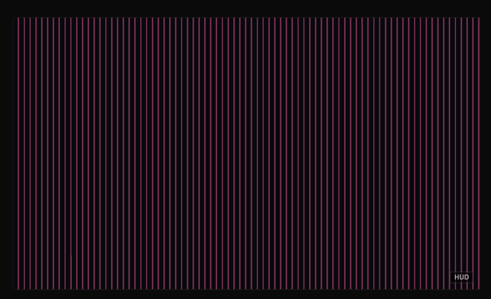
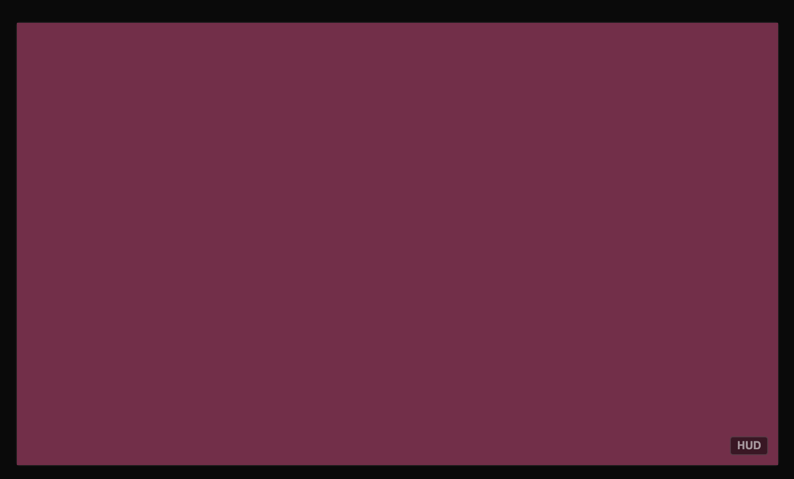
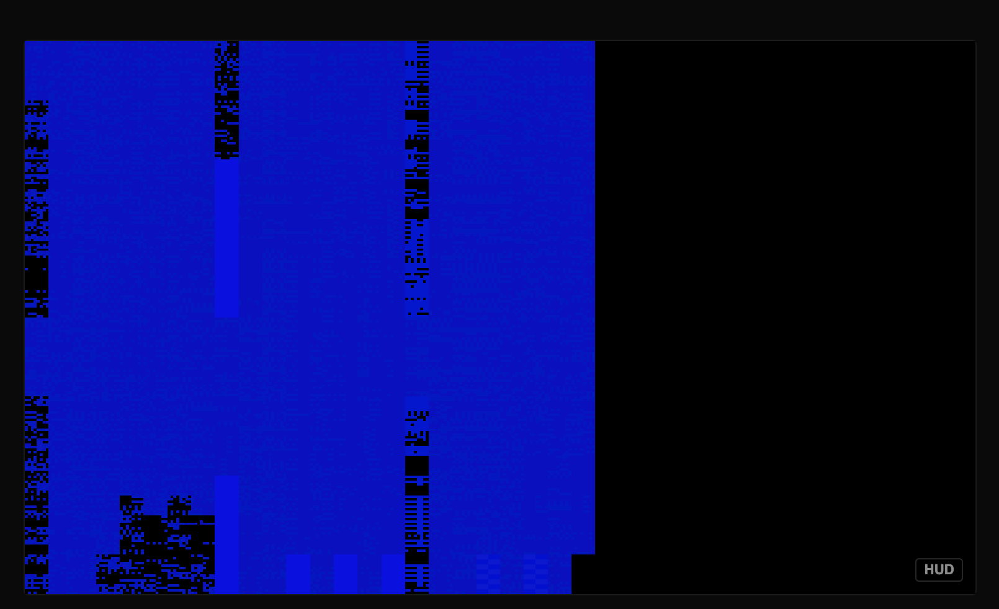

### PR #156 — pd4990a RTC (commit `b067563`)

Implementation complete du chip RTC uPD4990A basee sur FBNeo `neo_upd4990a.cpp` :
- Protocole CLK/STB/DATA_IN sur 4 bits
- Sortie TP : square wave, sortie DO : pulse 1Hz
- BCD time encoding dans registre 48-bit
- Timing cycle-accurate via compteur de cycles 68K

Les patches BIOS (PR #157) sont ensuite retires — le boot est maintenant natif.

### PR #158 — Tile decode planaire + BIOS boot debloque (commits `cb28bb7`, `44c3a28`)

Deux bugs critiques :

1. **Composite vector table** correctement implemente cette fois (0x00-0x7F BIOS, 0x80+ P-ROM).

2. **Format C-ROM Neo-Geo = planaire** (bitplanes C1/C2), pas nibble-packed comme CPS1. Erreur identique au pattern CPS1 initial (Jour 1, bug #5 — plane bit order dans `decodeRow`). Reecriture complete alignee sur FBNeo `NeoDecodeGfx`. Y position : `0x200 - yRaw` avec wrapping (ypos > 272 → -512).

**Resultat** : Ninja Combat boot complet — crosshatch → eye-catcher → in-game ! Le premier jeu Neo-Geo jouable.

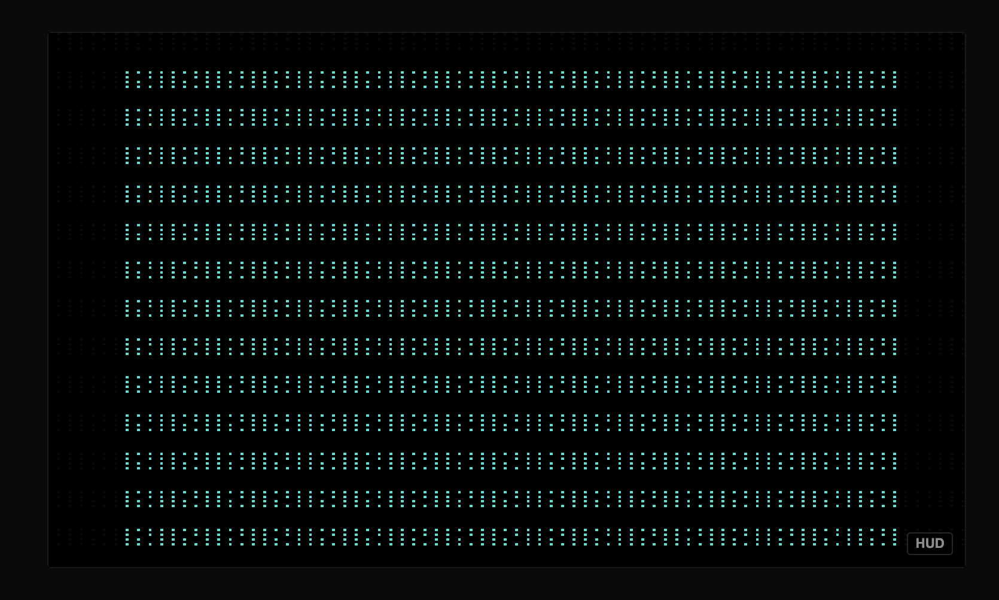
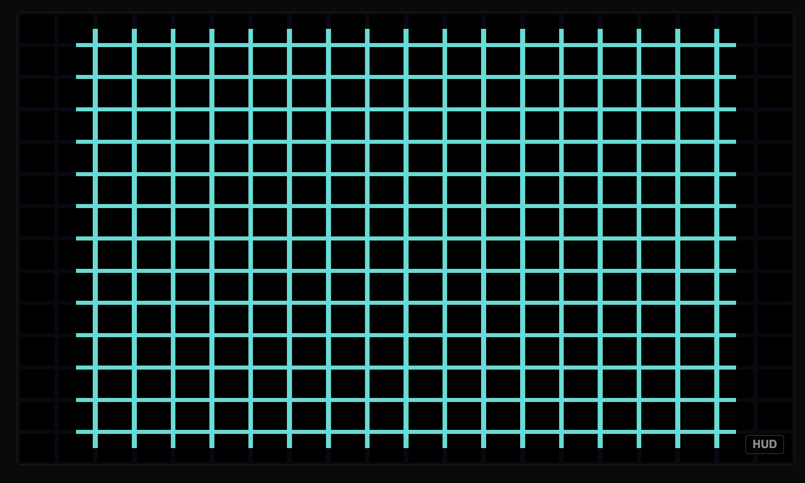
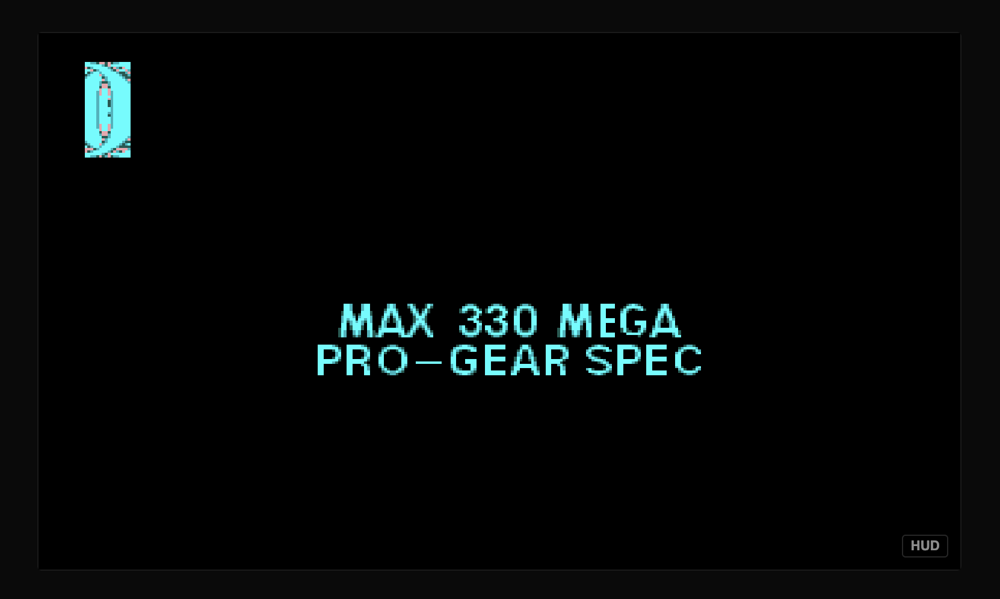
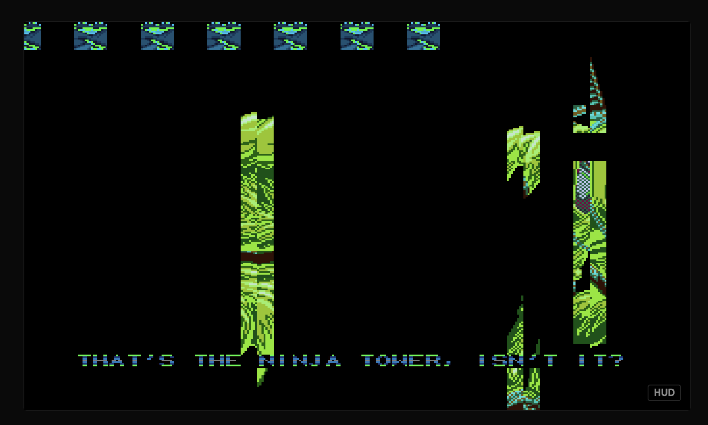
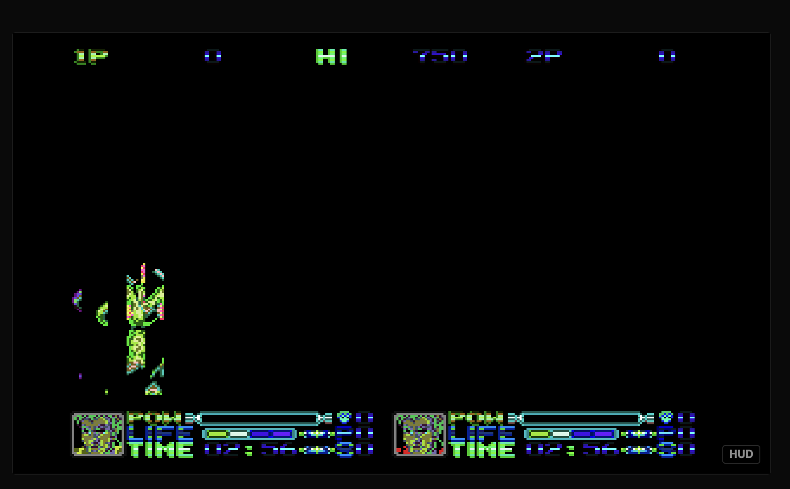

---

## Jour 15 — Du premier jeu jouable aux raster effects (10 avril)

### PR #159 — Color decode + sprite pipeline (commit `266eb5b`)

Format palette Neo-Geo 16-bit : 5 bits par canal + dark bit (6eme bit DAC, resistance 8200 Ohm). Le dark bit ajoute un demi-step de luminosite a chaque canal — un mecanisme unique au Neo-Geo.

Sticky chain corrige : le Neo-Geo chaine ses sprites via un "sticky bit". Si le bit est set, le sprite herite de la position Y et de la hauteur du sprite precedent (le "maitre"). Le forward pass pre-calcule les positions cumulatives. Sans ca, les sprites chaines sont disperses n'importe ou.

Bug flipH double-flip : le flip horizontal etait applique deux fois (a la source et a la destination) = pas de flip. Un pattern d'erreur classique quand on porte du code de reference sans comprendre a quel niveau chaque flip s'applique.

**Resultat** : Ninja Combat avec couleurs correctes et sprites corrects.

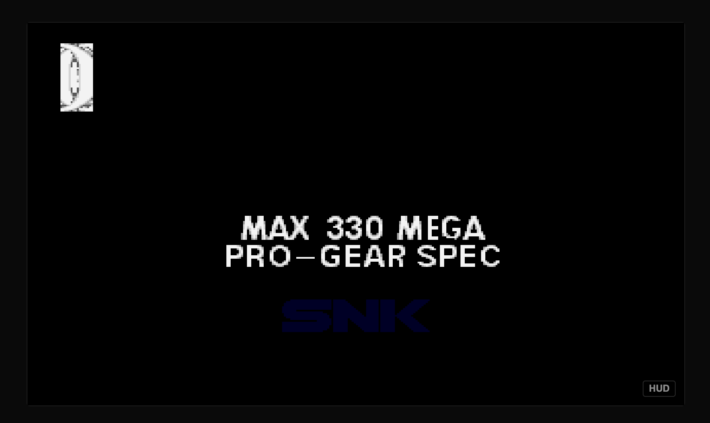
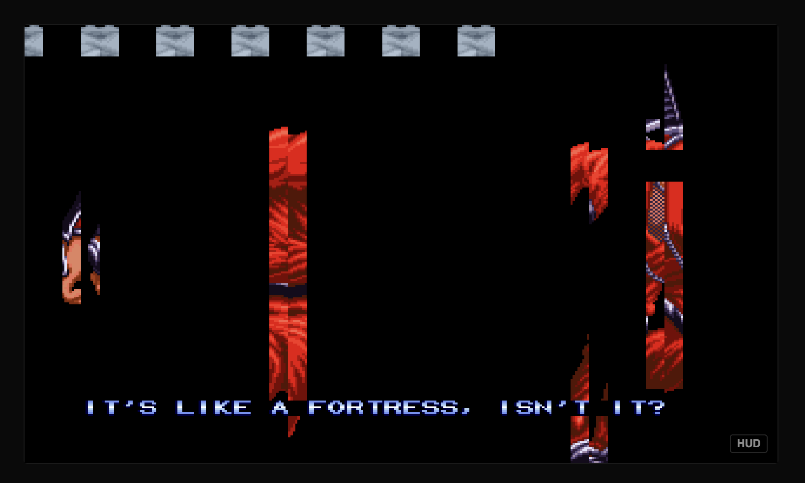
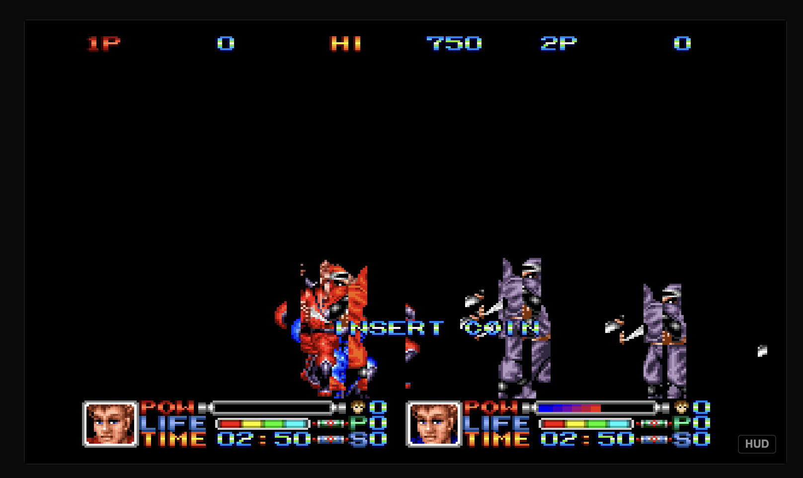

### PR #160 — Tile mask + half-order + 178 game defs (commit `c93ee29`)

**Tile mask** (`nNeoTileMask` de FBNeo) — wraps les tile codes au range ROM au lieu de skipper. Sans ca, 67% des sprites des title screens manquaient. Le fix est une ligne : `tileCode &= tileMask` au lieu de `if (tileCode > maxTile) return`.

**C-ROM half-order** — Les blocs 64-127 = left half, 0-63 = right half. L'ordre initial etait inverse. Pattern similaire au bug CPS1 `decodeRow` byte order (Jour 1).

**Game defs** : 52 → 178 parent sets, regenere depuis MAME `neogeo.xml`.

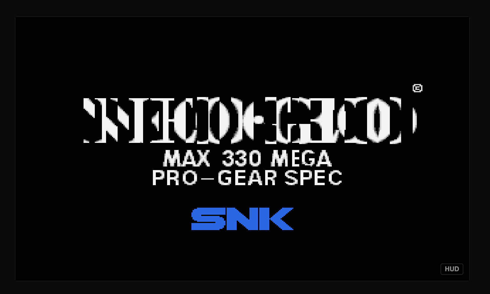
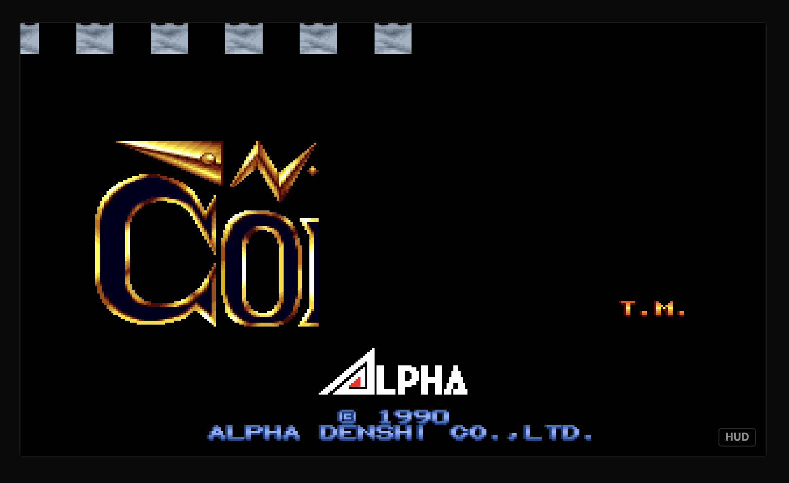
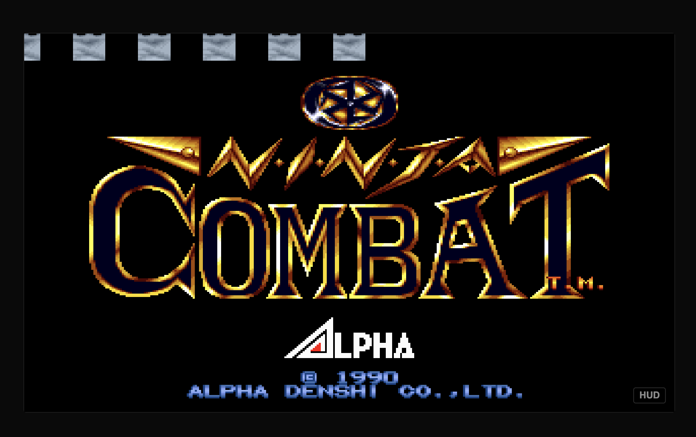

### PR #161 — Sprite zoom + render order (commit `5391bad`)

Quatre corrections dans un seul PR :

1. **Render order inverse** — Le hardware Neo-Geo rend les sprites low index = devant. Le code rendait high index = devant. Fix : rendu high→low.

2. **Y offset -16** pour la fenetre visible, X wrapping a 480 (pas 320).

3. **Support `000-lo.lo`** — La table shrink (256×256 entries) mapppe les niveaux de zoom aux pixels a dessiner. Fallback lineaire si la ROM est absente.

4. **Zoom X** via 16 bitmasks 16-bit (MAME-aligned) : selection des pixels source selon le niveau de zoom. Chaque bit du mask indique si le pixel correspondant est dessine.

**Resultat** : Art of Fighting — title screen propre, fighters visibles en combat.

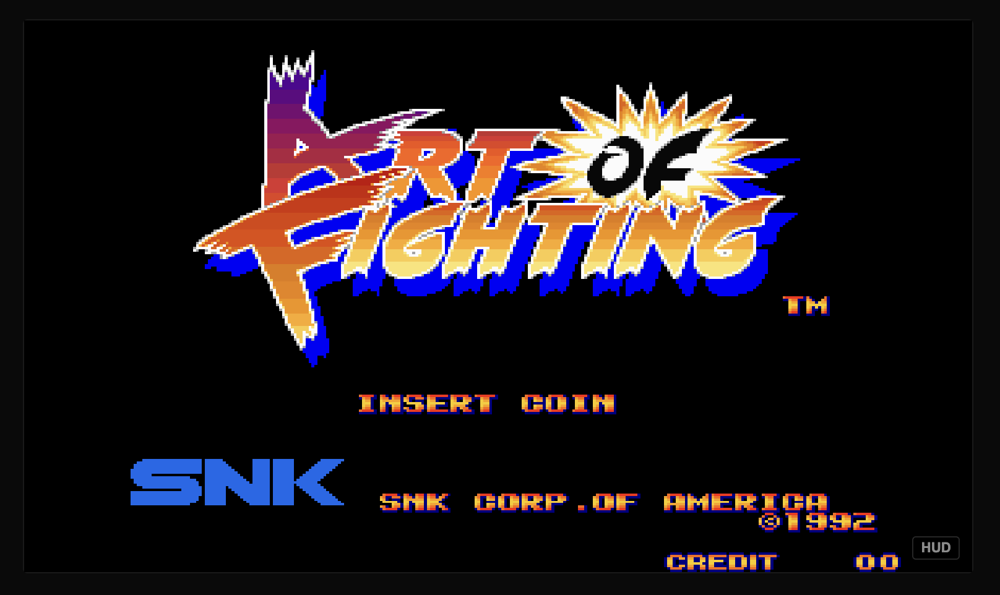
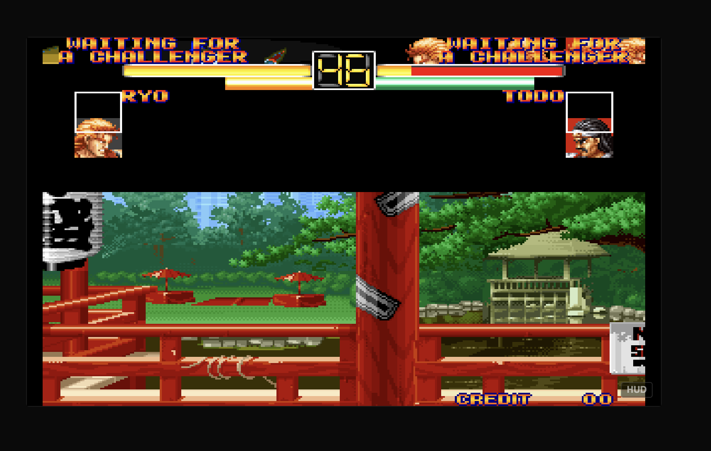

### Scanline slice rendering (commit `eb3d5f9`)

Le probleme le plus subtil de la session. Art of Fighting (et d'autres jeux) modifie la VRAM mid-frame via le handler IRQ2 (timer LSPC). Le handler change les positions, tailles, et tile codes des sprites **pendant** que le frame se dessine. Sans rendu par tranche, tous les sprites sont rendus avec l'etat VRAM de fin de frame → rendu "bouillie".

La solution decoupe le frame en tranches de scanlines :

```typescript
// Dans neogeo-emulator.ts
beginFrame();           // clear + palette, une seule fois
for (scanline = 0..223) {
  tickLSPCTimer();
  if (irq2Fired) {
    renderSlice(lastY, scanline);  // flush avant modification VRAM
    lastY = scanline;
    // le handler 68K modifie la VRAM ici
  }
}
renderSlice(lastY, 224); // flush le reste
```

Le forward pass sprite est re-execute a chaque slice — il faut recalculer les positions sticky chain avec l'etat VRAM courant. Sans IRQ2 timer → slice unique [0, 224) → zero regression sur les jeux simples.

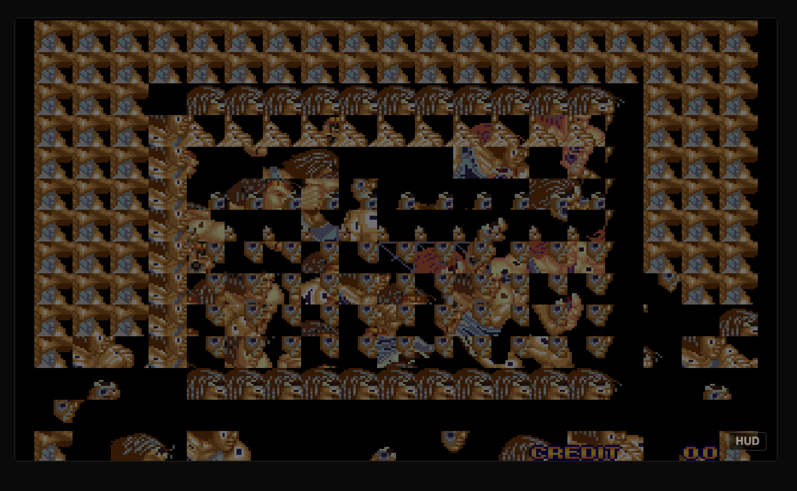
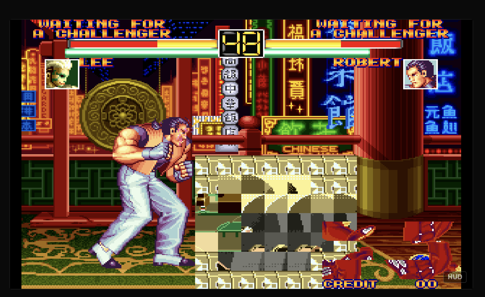
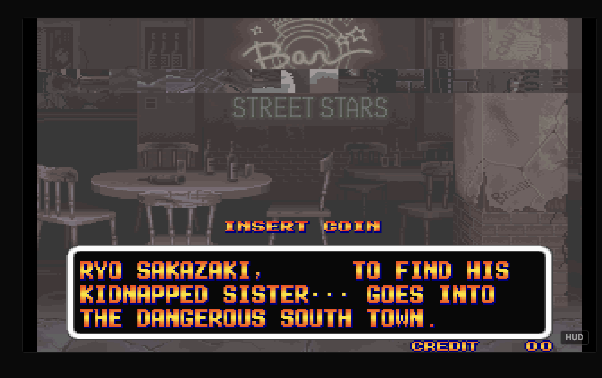
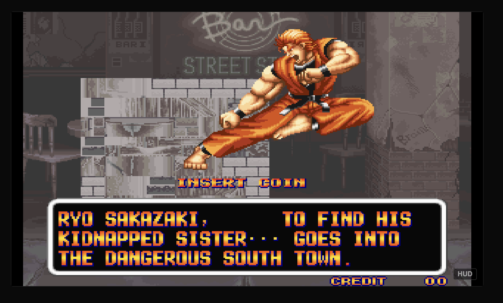

---

## Jour 16 — VRAM, inputs MVS, P-ROM banking (11 avril)

### VRAM read/write pointers separes (commit `d6fcb7e`)

Le LSPC a deux pointeurs VRAM distincts : un pour l'ecriture, un pour la lecture. Ils sont latches ensemble au set de l'adresse, puis auto-incrementes independamment. Sur CPS1, ce probleme n'existe pas (acces direct via l'adresse).

Le symptome : le test VRAM du BIOS echoue. Le BIOS ecrit une valeur, relit a la meme adresse pour verifier, mais l'auto-increment de l'ecriture a avance le pointeur read aussi → lecture a la mauvaise adresse.

**Fix** : deux pointeurs separes `vramWriteAddr` et `vramReadAddr`, latches ensemble sur ecriture de REG_VRAMADDR, incrementes independamment.

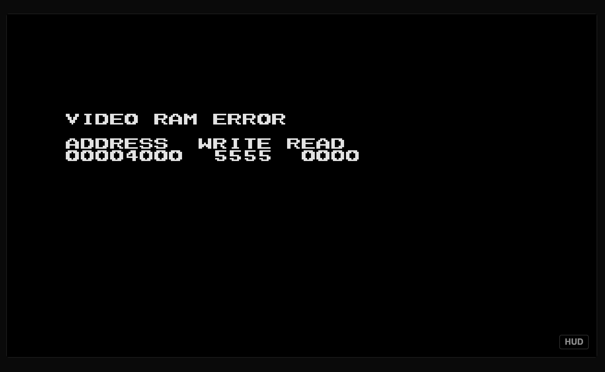

### MVS input ports (commits `d6fcb7e`, `2681f7b`)

La Neo-Geo utilise un mapping de bits different du CPS1 pour les directions :
- CPS1 : R/L/D/U = bits 0-3
- Neo-Geo : U/D/L/R = bits 0-3

Autres corrections :
- Coins (0x380001) separes des starts (0x340001) — sur CPS1 tout est dans le meme registre
- REG_STATUS_B : 0x00 pour MVS (etait 0xFF = AES) — ce registre distingue l'arcade du systeme home
- Byte order ports corrige (P1 a 0x300000 even, system a 0x380000)
- LSPC byte writes : assembles en words (etaient ignores). Le bus buffer le high byte et dispatch sur l'ecriture du odd byte

### Sprite rendering MAME-aligned (commit `2681f7b`)

Deux alignements sur l'implementation MAME :
- **Y-zoom** : algorithme XOR MAME (inversion de la table shrink) remplace la logique custom
- **X-zoom** : `ZOOM_X_TABLES` bitmask + `sprXZoom` dans le forward pass

### P-ROM banking (commit `bdd7849`)

Les jeux > 1 MB (KOF97 = 3 MB) ont besoin de bank switching sur 0x200000-0x2FFFFF. Le PORTWEL latch D0/D1 selectionne le bank P2. 13 lignes dans `neogeo-bus.ts` :

```typescript
// P-ROM banking (games > 1MB)
case 0x2FFFF0: // PORTWEL — select P2 bank
  this.pRomBank = value & 0x03;
  break;
```

**Resultat** : KOF97 passe de black screen a warning screen. La protection cartouche (SMA, PVC, CMC) reste a implementer pour aller plus loin.

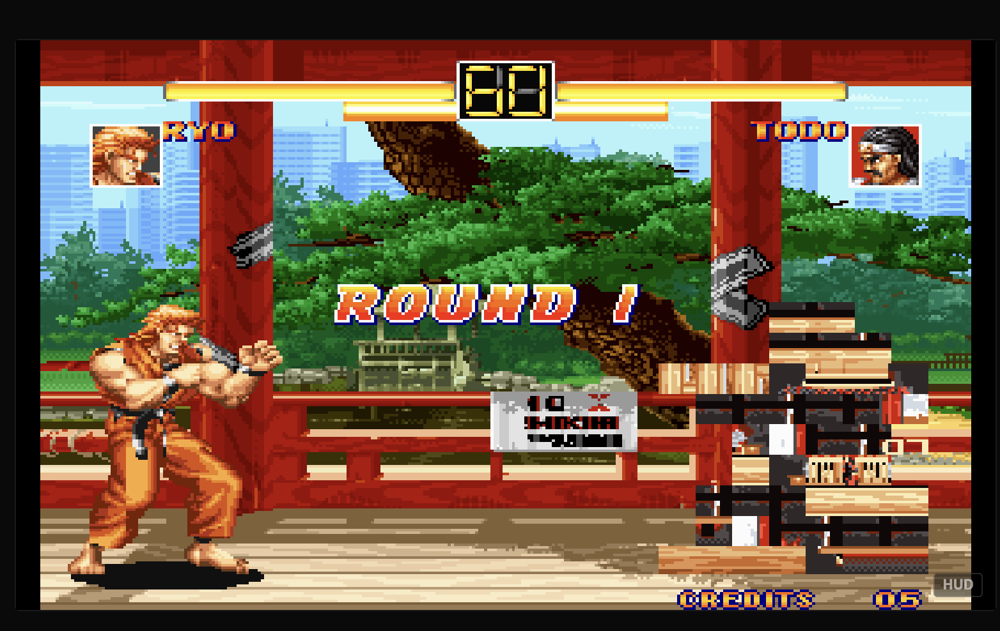
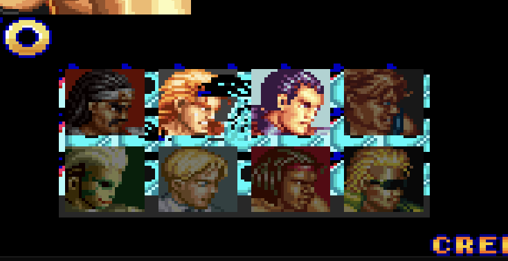
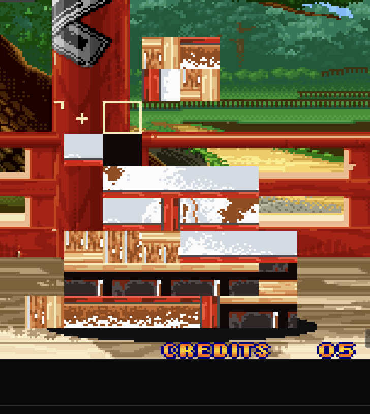
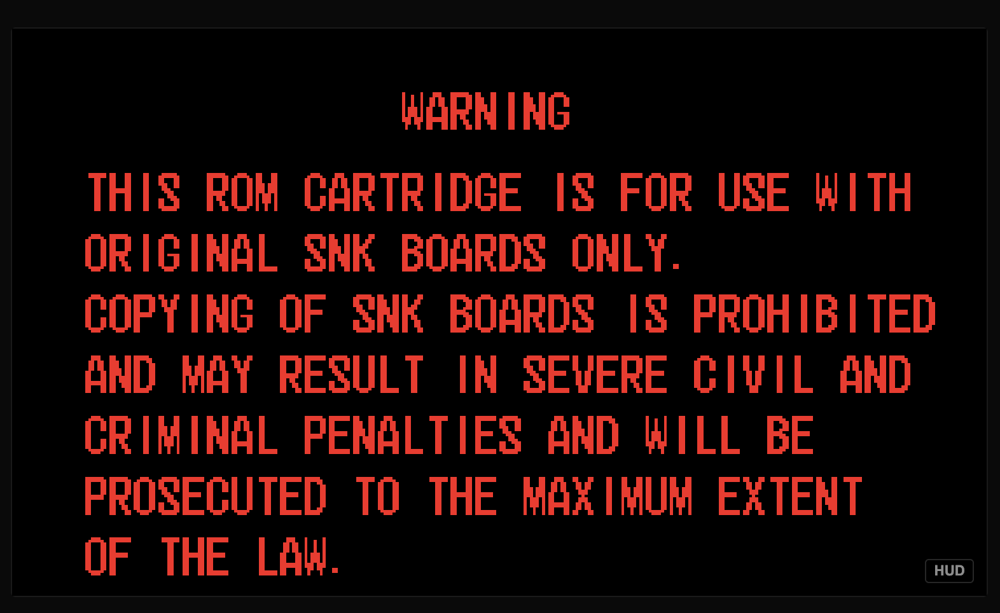

### Decisions architecturales Neo-Geo

| Decision | Choix | Pourquoi |
|----------|-------|----------|
| Emulation parallele | CPS1 et Neo-Geo coexistent, auto-detection au drop | Pas de fork, renderers partages via `resize()` |
| Direct boot | P-ROM mappe a 0x000000, skip BIOS | Le BIOS a des tests trop stricts, le direct boot est plus fiable |
| YM2610 WASM (ymfm) | BSD-3, compile Emscripten | Deux instances : main thread (handshake BIOS) + worker audio |
| Interleaving 68K/Z80 | Slices de 128 cycles | Tight polling BIOS, ratio 1:3 (4MHz/12MHz) |
| Slice rendering | Flush avant IRQ2 handler | Le forward pass sprite est re-execute par slice |
| pd4990a cycle-accurate | Compteur de cycles 68K total | Pas de `setInterval` — requis pour le test calendrier BIOS |

---

## Jour 14-16 — Ligne de temps des commits Neo-Geo

### Jour 14 — 9 avril 2026 (~25 commits)

```
0dc298d  feat: add Neo-Geo (MVS/AES) emulation support ← 14 700 LIGNES
1a29efc  fix: load BIOS Z80 ROM (sm1.sm1) for Neo-Geo sound init
4947b8c  fix: Neo-Geo BIOS boot — RTC, IRQ, sound register fixes
87bb470  fix: Neo-Geo IRQ ack + sound protocol per FBNeo
ae7d50e  fix: Neo-Geo BIOS completes boot — patch all error jumps, fix sound write
65f31a1  fix: Neo-Geo BIOS boot completes — eye catcher visible
8742b35  fix: Neo-Geo control register mapping per FBNeo
da41595  fix: Z80 NMI edge-trigger + sound handshake works
691bb42  fix: composite vector table at 0x000000 per FBNeo
e318517  fix: direct game boot + performance progress
974d62c  fix: sound reply preservation + performance boost
d538c1c  fix: calendar range check bypass + direct game boot
42afc13  fix: BIOS reaches eye catcher with sprites visible!
8ada169  test: add Neo-Geo boot E2E diagnostic test
b067563  feat: implement pd4990a RTC chip for Neo-Geo
cbe7e15  fix: re-enable calendar patches alongside pd4990a
b881f35  feat: pd4990a RTC works — BIOS eye catcher renders 381 sprites
5170003  fix: pd4990a timing — use real cycles only, remove estimate hack
06f442d  fix: Z80 comm test debugging — isolate reply, force per-command
231fb53  fix: remove all BIOS patches — pd4990a passes CALENDAR + checksum
0e876cf  feat: YM2610 WASM on main thread for Z80 sound init
8350937  fix: deliver YM2610 timer IRQ to Z80 on main thread
bce08fb  feat: BIOS passes ALL tests — full boot with graphics!
b94e059  fix: prefer MVS BIOS (all tests pass), 4KB memory card RAM
cb28bb7  fix: unblock Neo-Geo BIOS boot — composite vector mapping + LSPC register fixes
44c3a28  fix: planar tile decode, Y wrapping, enhanced e2e boot test ← NINJA COMBAT IN-GAME
```

### Jour 15 — 10 avril 2026 (~12 commits)

```
266eb5b  fix: Neo-Geo color decode + sprite rendering pipeline
c93ee29  fix: Neo-Geo tile mask + half-order + full game defs (178 games)
5391bad  fix: Neo-Geo sprite render order, Y/X positioning, zoom infrastructure
a3c8ae4  fix: improved sprite diagnostic dump with zoom and depth info
eb3d5f9  feat: Neo-Geo scanline slice rendering (IRQ2 raster effects)
```

### Jour 16 — 11 avril 2026 (~6 commits)

```
d6fcb7e  fix: Neo-Geo VRAM separate read/write pointers + MVS input port mapping
2681f7b  fix: Neo-Geo MVS input ports, sprite rendering (MAME-aligned), LSPC byte writes
bdd7849  fix: Neo-Geo P-ROM banking for games > 1MB (KOF97 boots)
```

---

## Patterns et observations (mise a jour)

### Nouveaux patterns

6. **La dedup est un probleme de hash** — Trois sites de deduplication avec trois formules differentes = des doublons inevitables. Lecon : une seule fonction de hash, appelee partout. `poseHash()` est devenue la source de verite.

7. **Mono-palette simplifie tout** — CPS1 est multi-palette par design, mais Aseprite est mono-palette. Aligner la capture sur la contrainte de l'outil de sortie (Aseprite) elimine une classe entiere de bugs.

8. **Les headers de securite sont un champ de mines** — COOP/COEP pour SharedArrayBuffer vs iframes/embeds YouTube. 5 releases en un jour pour 3 lignes de config. Chaque plateforme d'hebergement a sa propre syntaxe.

9. **Dead code invisible** — 3 500 lignes de code mort (ym2151.ts, nuked-opm.ts) marquees "kept as reference" alors que le git history EST la reference. 360 lignes de CSS orphelines. Le code mort s'accumule silencieusement quand on pivote sans nettoyer.

10. **Tile decode : toujours le meme piege** — Le format graphique est la premiere erreur sur chaque nouveau systeme. CPS1 Jour 1 : plane bit order. Neo-Geo Jour 14 : nibble-packed vs planaire. La solution est toujours la meme : lire FBNeo/MAME d'abord, coder ensuite.

11. **Le BIOS est un programme complet** — Le BIOS MVS teste tout le hardware de maniere exhaustive. Chaque composant non emule (RTC, son, VRAM) bloque le boot. Le direct boot est un raccourci utile, mais le boot natif valide l'emulation.

12. **Slice rendering vs frame rendering** — Les jeux qui modifient la VRAM mid-frame (via IRQ2) sont rendus "bouillie" avec un rendu par frame complet. Le rendu par tranche de scanlines ajoute de la complexite mais resout le probleme sans regression sur les jeux simples.

### Ce que Claude fait bien (ajouts)

- **Tests en volume** : 103 tests unitaires pour 10 modules en une session, game matrix E2E pour 29 ROMs
- **Refactoring chirurgical** : extraction de modules avec validation build + 903 tests entre chaque etape
- **Release engineering** : script de release, versioning beta, configuration Vercel — la mecanique de livraison

### Ce que Claude fait mal (ajouts)

- **Config hosting** : les headers COOP/COEP sur Vercel ont necessite 5 iterations — la comprehension du routage Vercel par path est approximative
- **Revert/re-apply** : la sequence beta gate (apply → revert → re-apply) montre un manque de reflexion avant execution
- **CI Claude** : le workflow GitHub Actions avec Claude en agent autonome reste instable — trop de variables (timeout, permissions, contexte)

---

## Chiffres cles (mis a jour)

| Metrique | Valeur |
|----------|--------|
| Duree totale | 16 jours (17 mars — 11 avril 2026) |
| Commits (hors merges) | ~260 |
| Lignes TypeScript | ~37 000+ |
| Insertions source totales | ~55 000+ |
| Jeux supportes CPS1 (GameDefs) | 41 parents |
| Jeux supportes Neo-Geo (GameDefs) | 178 parents |
| Jeux dans le catalogue CPS1 | 245 |
| Vecteurs de test M68000 | 16 800 (84 × 200) |
| Vecteurs de test Z80 | 117 600 (588 × 200) |
| Tests unitaires | 1 016+ |
| Tests E2E | ~115 (16 spec files) |
| Game matrix | 29 ROMs CPS1 (boot + audio check) |
| Composants hardware emules | 12 (M68000, Z80, YM2151, OKI6295, QSound, CPS-A, CPS-B, LSPC2, YM2610, uPD4990A, shrink ROM, P-ROM banking) |
| Systemes arcade emules | 2 (CPS1, Neo-Geo MVS) |
| Renderers | 3 (WebGL2, Canvas 2D, DOM hybrid) |
| CPU total (apres optim) | ~22% (M68000+video ~11%, audio ~11%) |
| Releases | 8 (beta.1 → beta.3 → 1.0.0 → 1.0.5) |
| LOC Neo-Geo MVP | ~14 700 (PR #154, un seul commit) |
| Bug le plus vicieux | `fetchByte` au lieu de `fetchOpcode` dans CB/ED/DD/FD (3 lignes, QSound muet) |
| Bug le plus sournois | `~level & 0xffff` (1 ligne, canaux YM2151 silencieux) |
| Bug le plus frequent (categorie) | Byte order / endianness (5+ occurrences, CPS1 et Neo-Geo) |
| Bug le plus tordu Neo-Geo | Composite vector table (BIOS vs P-ROM, corrige 3 fois) |
| Temps de debug le plus long | QSound audio (~12h) — resolu en 2min via MAME debugger |
| Nettoyage le plus massif | -3 500 LOC dead code + -360 LOC CSS en un jour |
| Le plus de releases en un jour | 5 (1.0.1 → 1.0.5, toutes pour COOP/COEP headers) |
| Du zero a in-game Neo-Geo | 2 jours (Jour 14-15, Ninja Combat jouable) |

---

*Derniere mise a jour : 11 avril 2026*
*Sprixe emule deux systemes arcade (CPS1 + Neo-Geo) dans un navigateur. Du premier commit CPS1 au jeu jouable en 5 jours. Du zero Neo-Geo a Ninja Combat in-game en 2 jours. 37 000+ lignes de TypeScript, zero dependance d'emulation, 219 game defs (41 CPS1 + 178 Neo-Geo).*
