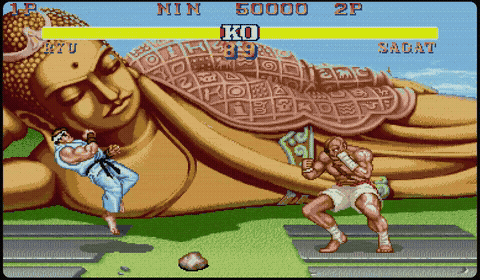

# ROMstudio

**A CPS1 arcade studio in the browser.** Play, inspect, and modify — zero install.

> Play Street Fighter II, Final Fight, Cadillacs & Dinosaurs, and 30+ Capcom classics. Then open the studio tools to see how the hardware works, isolate audio channels, and replace sound samples.



## Studio (E)

Capture → Aseprite → Import. Zero in-app editing.

- **Sprite capture** — REC button records sprite poses during gameplay, auto-deduplication
- **Scroll capture** — REC per scroll layer, accumulates tiles as you scroll
- **Export .aseprite** — Indexed 8bpp with embedded ROM manifest for round-trip
- **Import .aseprite** — Tiles written back to GFX ROM, immediate re-render
- **Palette snapshot** — RGB values captured at recording time (no fade/flash artifacts)
- **Layer panel** — HW layer toggles, REC buttons, sprite/scroll set cards, 3D exploded view

## Video (F2)

Real-time hardware inspector — the game keeps running.

- **Layer toggles** — show/hide each of the 4 hardware layers (Scroll 1/2/3, Sprites)
- **3D exploded view** — separate layers in Z-space with CSS perspective, drag to rotate
- **Tile viewer** — click any pixel to identify which layer drew it
- **Frame-by-frame** — pause, step forward one frame at a time

## Audio (F3)

### Tracks tab
- **8 FM channels** (YM2151) — note name, VU meter, hit timeline, mute/solo
- **4 OKI voices** (ADPCM) — waveform oscilloscope, mute/solo
- **Piano roll** — Cubase-style Key Editor with vertical keyboard, selectable per track
- **Mute/Solo** per channel — isolate bass, melody, percussion independently

### Samples tab
- **Sample browser** — list all OKI ADPCM phrases with duration and size
- **Preview** — click ▶ to hear any sample
- **Replace** — drag & drop a WAV to replace a sample in real-time
- **Import/Export Set** — ZIP of all samples as WAV, round-trip editing
- **Microphone recording** — record from mic to replace a sample

Because everything is decoded in TypeScript, every layer, sprite, palette, and audio channel exists as an inspectable, modifiable JavaScript object. This is what makes the studio possible.

## Try it

**[Live demo](https://arcade-ts.vercel.app)** — drop a MAME ROM (.zip) onto the screen.

## Under the hood

Every component is written from scratch in TypeScript:

- **M68000 CPU** — full interpreter, 3000+ lines
- **Z80 CPU** — full interpreter, 2200+ lines
- **YM2151 FM synthesis** — via [Nuked OPM](https://github.com/nukeykt/Nuked-OPM) compiled to WASM (the only non-TS component)
- **OKI MSM6295 ADPCM** — pure TypeScript decoder
- **CPS-A/CPS-B video** — tile decode, 3 scroll layers, sprites, palette, priority
- **WebGL2 renderer** with Canvas 2D fallback

The audio subsystem runs in a dedicated **Web Worker** with its own Z80+YM2151+OKI instances, communicating via **SharedArrayBuffer** — just like the real hardware where the audio CPU runs on its own crystal, independent from the main CPU.

## Features

- **32 games** fully playable (8 with known issues — see below)
- **Save states** with full audio restore (F5/F8)
- **Gamepad support** with per-player device assignment
- **Keyboard remapping** with AZERTY/QWERTY auto-detection
- **DIP switches** — 56 games with real MAME definitions
- **CRT filter** — scanlines + barrel vignetting
- **TATE mode** for vertical games (1941, Varth...)
- **Autofire** per button
- **QSound** support (Cadillacs & Dinosaurs, The Punisher, Warriors of Fate)
- **Fullscreen** — double-click or double-tap
- **~22% CPU** on a modern machine (main thread ~11%, audio worker ~11%)

## ROM files

**This emulator does not include any ROM files.** You must provide your own legally obtained MAME ROM sets.

CPS1 games are copyrighted by Capcom. Only use ROM dumps from arcade hardware you own.

### Format

MAME 0.286 non-merged ROM sets in ZIP format. The filename must match the MAME convention (`sf2.zip`, `ffight.zip`, `dino.zip`...).

### Supported games

| Game | ROM |
|------|-----|
| Street Fighter II: The World Warrior | `sf2` |
| Street Fighter II': Champion Edition | `sf2ce` |
| Street Fighter II': Hyper Fighting | `sf2hf` |
| Final Fight | `ffight` |
| Cadillacs and Dinosaurs | `dino` |
| The Punisher | `punisher` |
| Knights of the Round | `knights` |
| Captain Commando | `captcomm` |
| Ghouls'n Ghosts | `ghouls` |
| Strider | `strider` |
| Three Wonders | `3wonders` |
| Mega Man: The Power Battle | `megaman` |
| Warriors of Fate | `wof` |
| Saturday Night Slam Masters | `slammast` |
| 1941: Counter Attack | `1941` |
| Mercs | `mercs` |
| Varth: Operation Thunderstorm | `varth` |
| King of Dragons | `kod` |
| Willow | `willow` |

...and more. See [`src/game-catalog.ts`](src/game-catalog.ts) for the full list.

### Known issues

These 8 games load but have bugs (graphics glitches, crashes, or missing features):

| Game | ROM | Issue |
|------|-----|-------|
| Captain Commando | `captcomm` | Not working |
| Carrier Air Wing | `cawing` | Not working |
| Forgotten Worlds | `forgottn` | Not working |
| Ganbare! Marine Kun | `ganbare` | Not working |
| King of Dragons | `kod` | Crashes on stage load |
| Mega Bomberman | `mbombrd` | Not working |
| Pang! 3 | `pang3` | Not working |
| Pnickies / Monster | `pmonster` | Not working |
| Saturday Night Slam Masters | `slammast` | Not working |

## Getting started

```bash
npm install
npm run dev
```

Open `http://localhost:5173/play/` and drop a ROM ZIP onto the screen.

For local ROM loading, place `.zip` files in `public/roms/` — they'll appear in the game selector.

### Controls

| Key | Action |
|-----|--------|
| Arrow keys | Move |
| A, S, D | Buttons 1-3 |
| Z, X, C | Buttons 4-6 |
| 5 | Insert coin |
| 1 | 1P Start |
| P | Pause |
| M | Mute |
| E | Studio (capture/export) |
| F1 | Config |
| F2 | Video panel |
| F3 | Audio panel |
| F4 | Synth (FM Patch Editor) |
| F5 | Save state |
| F8 | Load state |
| F | Fullscreen |
| Escape | Close dialog |

Gamepads supported via the Web Gamepad API. Configure in **Config > Joypad**.

## Building

```bash
npm run build    # TypeScript + Vite → dist/
npm run preview  # Preview production build
npm test         # Unit tests (Vitest)
```

### Hosting

SharedArrayBuffer requires these HTTP headers:

```
Cross-Origin-Opener-Policy: same-origin
Cross-Origin-Embedder-Policy: require-corp
```

A `vercel.json` is included for one-click Vercel deployment. For other hosts, configure the headers manually.

## Architecture

```
                    ┌─────────────┐
                    │   Browser   │
                    └──────┬──────┘
                           │
              ┌────────────┼────────────┐
              │            │            │
     ┌────────▼──────┐ ┌──▼───┐ ┌─────▼──────┐
     │  Main Thread   │ │Worker│ │  AudioWorklet│
     │                │ │      │ │             │
     │ M68000 @ 10MHz │ │ Z80  │ │ Ring buffer │
     │ CPS-A/B video  │ │YM2151│ │ → speakers  │
     │ Input/UI       │ │OKI   │ │             │
     │ WebGL2 render  │ │      │ │             │
     └────────┬───────┘ └──┬───┘ └──────▲──────┘
              │            │            │
              │ sound      │ samples    │ SharedArrayBuffer
              │ latch      └────────────┘
              │
              └─── frame loop @ 59.637 Hz
```

### Source layout

```
src/
  cpu/m68000.ts          Motorola 68000 interpreter
  cpu/z80.ts             Zilog Z80 interpreter
  video/cps1-video.ts    CPS-A/CPS-B tile decode, layers, sprites
  video/renderer-webgl.ts WebGL2 renderer
  audio/audio-worker.ts  Web Worker: Z80 + YM2151 + OKI
  audio/audio-output.ts  AudioWorklet + SharedArrayBuffer
  audio/nuked-opm-wasm.ts YM2151 WASM wrapper
  audio/oki6295.ts       OKI MSM6295 ADPCM decoder
  memory/bus.ts          68K bus (memory map, I/O, CPS registers)
  memory/z80-bus.ts      Z80 bus (audio ROM, YM2151, OKI)
  memory/rom-loader.ts   MAME ZIP ROM loader
  debug/debug-panel.ts   Video inspector panel (F2)
  debug/debug-renderer.ts Layer mask + 3D exploded rendering
  audio/audio-panel.ts   Audio DAW panel (F3) — tracks + samples tabs
  audio/audio-viz.ts     SharedArrayBuffer bridge (Worker ↔ Main thread)
  audio/oki-codec.ts     OKI ADPCM encoder/decoder for sample editing
  editor/sprite-editor-ui.ts  Tile viewer UI, overlay, palette
  editor/sheet-viewer.ts      Fullscreen sprite sheet + scroll set viewer
  editor/aseprite-io.ts       Aseprite import/export (sprites + scroll tilemaps)
  editor/capture-session.ts   Sprite pose + scroll tile capture manager
  editor/layer-panel.ts       Left sidebar (HW layers, REC, capture sets)
  emulator.ts            Main loop, frame scheduling
  save-state.ts          Save/load state to localStorage
  dip-switches.ts        DIP switch definitions (from MAME)
  input/input.ts         Keyboard + Gamepad input
wasm/
  opm.c, opm.h           Nuked OPM source (LGPL 2.1+)
  opm.mjs                Compiled WASM module
```

## Hardware reference

| Component | Spec |
|-----------|------|
| Main CPU | Motorola 68000 @ 10 MHz |
| Audio CPU | Zilog Z80 @ 3.579545 MHz |
| Video | CPS-A + CPS-B custom ASICs |
| FM synthesis | Yamaha YM2151 (OPM) — 8 channels, 4 operators |
| ADPCM | OKI MSM6295 — 4 voices |
| Resolution | 384 x 224 @ 59.637 Hz |
| VRAM | 192 KB |
| Work RAM | 64 KB |

## Credits

- **[Nuked OPM](https://github.com/nukeykt/Nuked-OPM)** by Nuke.YKT — cycle-accurate YM2151 emulation (LGPL 2.1+)
- **[MAME](https://github.com/mamedev/mame)** — hardware documentation, game definitions, DIP switch layouts
- **[Tom Harte's ProcessorTests](https://github.com/TomHarte/ProcessorTests)** — M68000 test vectors
- **[SingleStepTests](https://github.com/SingleStepTests/z80)** — Z80 test vectors

## License

ISC — see [LICENSE](LICENSE).

Third-party components are under their respective licenses (see LICENSE for details).
