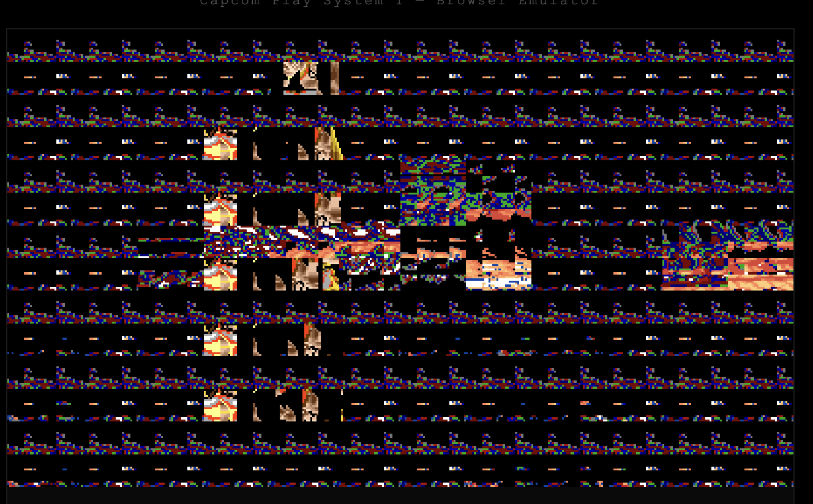
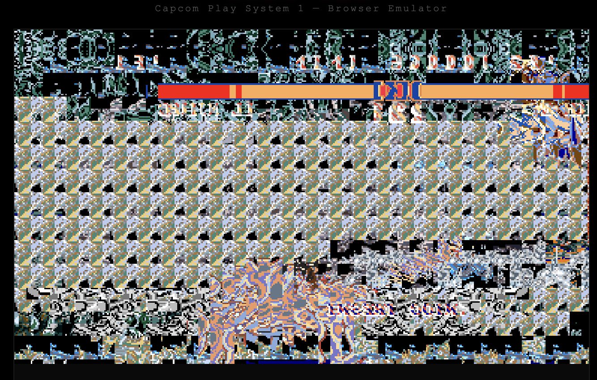
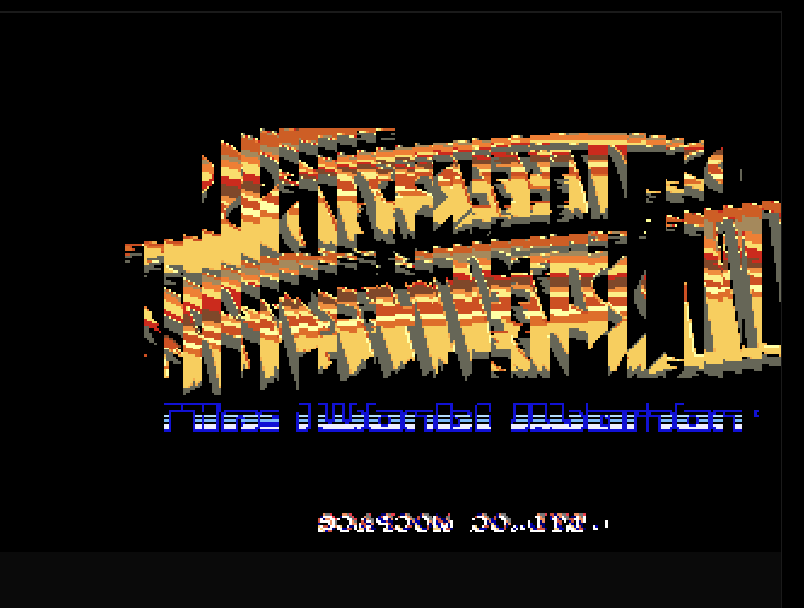
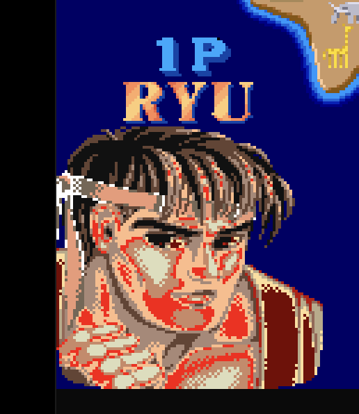
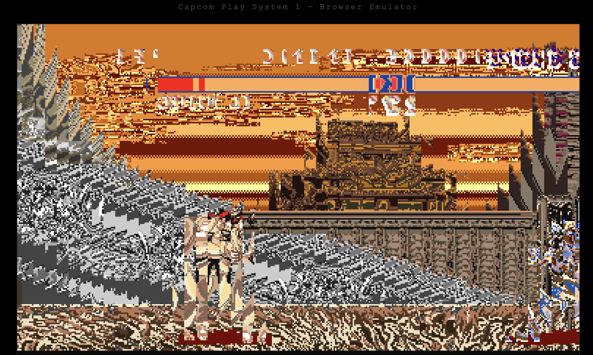
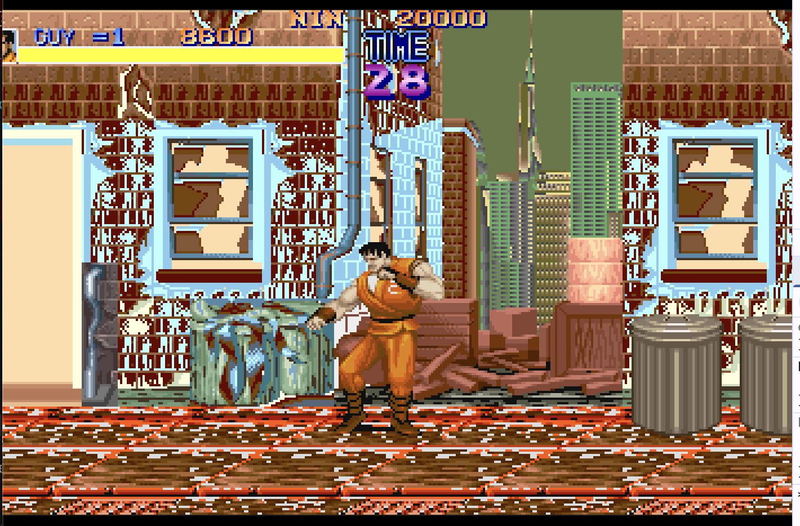
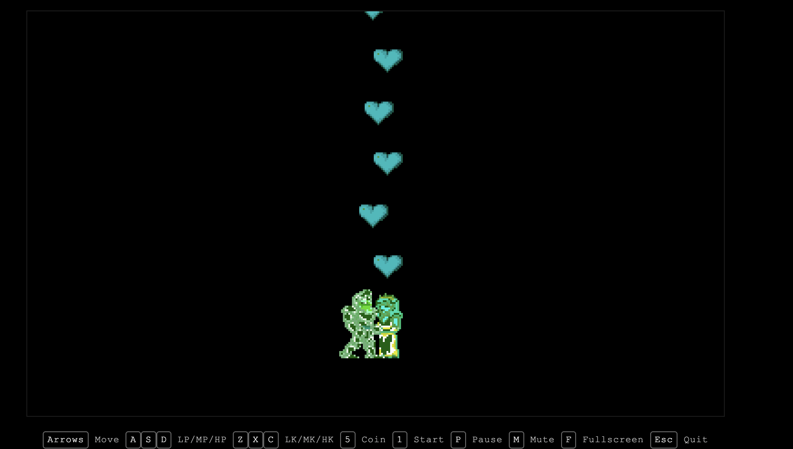
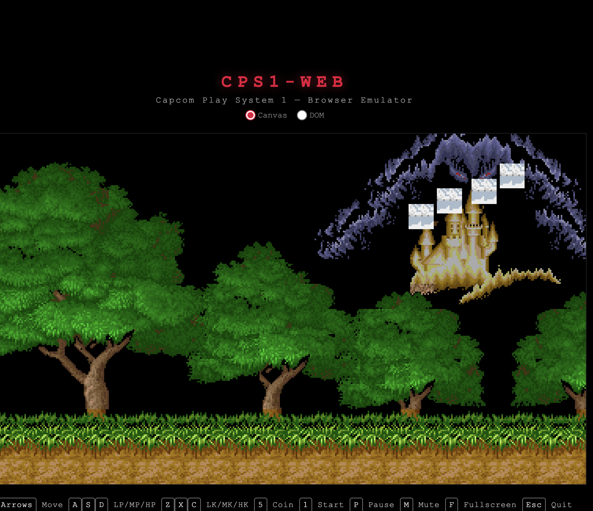

# Building a CPS1 Arcade Emulator from Scratch in TypeScript

*How I went from zero to playing Street Fighter II in the browser in 5 days — and what I learned about hardware, audio, and the browser as a platform.*

---

## The idea

<!-- TES MOTS : pourquoi ce projet ? qu'est-ce qui t'a motivé ? nostalgie arcade ? défi technique ? -->

The Capcom Play System 1 powered some of the most iconic arcade games of the late 80s and early 90s: Street Fighter II, Final Fight, Ghouls'n Ghosts, Cadillacs & Dinosaurs. I wanted to see if it was possible to emulate this hardware entirely in TypeScript — not a C/C++ port compiled to WASM, but every component written from scratch in a language designed for the web.

## Day 1 — From nothing to "something is happening"

The first commit was 8,900 lines. A complete M68000 CPU interpreter, a Z80 CPU, a memory bus, a ROM loader, a video renderer, and an input system.

Here's what it looked like:


*The first successful boot of Street Fighter II. Every pixel is wrong.*

This is what you get when the tile decoder reads pixels in the wrong order, the bank mapper is missing, and the transparent color is inverted. But the game is running — the 68000 is executing instructions, reading VRAM, and something is making it to the screen.

### The cascade of graphics bugs

Each fix revealed the next problem:

**Bank mapper** — CPS1 uses a custom PAL chip to translate tile codes through a per-game lookup table. Without it, every tile points to the wrong graphics data.


*Same tile repeated across the entire screen — the bank mapper returns the same value for everything.*

**Pixel bit order** — The GFX ROM encodes pixels MSB-first (bit 7 = leftmost pixel). My decoder had it backwards. Everything was horizontally mirrored at the sub-tile level.


*The Street Fighter II logo is recognizable but completely mangled. The text below is gibberish.*

**Plane bit assignment** — CPS1 tiles are 4 bits per pixel, stored across 4 bitplanes. I had the planes in the wrong order, producing psychedelic color artifacts:


*Ryu's portrait on the character select screen. The colors are close but contaminated with red — one bitplane is swapped.*

**Palette inversion** — I fixed the portraits, but the backgrounds were still in negative. Turns out color index 0 should be transparent, not color index 15. One constant, hours of debugging.


*The stage background rendered in inverted colors — like a photo negative.*

### The audio battle

<!-- TES MOTS : décris le moment où le premier son est sorti, l'émotion -->

Getting pixels on screen is satisfying. Getting sound out of the speakers is emotional.

The CPS1 audio system is its own computer: a Z80 CPU running at 3.58 MHz, connected to a Yamaha YM2151 FM synthesizer and an OKI MSM6295 ADPCM sample player. The main 68000 CPU communicates with the Z80 through a single byte — the "sound latch".

Three bugs stood between silence and music:

1. **Wrong I/O addresses** — The YM2151 and OKI registers were swapped. The Z80 was writing FM data to the sample player and vice versa.
2. **No timer interleaving** — The YM2151 timers only advanced after the Z80 finished its entire frame budget. But the Z80 music driver depends on Timer A interrupts to sequence notes. No interrupts during execution = the sequencer is frozen.
3. **Spurious IRQs** — Every sound latch write was triggering a Z80 interrupt. The CPS1 doesn't do this — the Z80 polls the latch during its Timer A interrupt routine.

<!-- TES MOTS : le moment "AUDIO WORKS" -->

## Day 2 — Making it sound right

The sound worked, but it didn't sound *right*. The YM2151 FM synthesis is notoriously difficult to emulate — four operators per channel, feedback loops, envelope generators with precise timing.

After four incremental fixes (busy flag 64x too long, modulation shift missing, envelope clocking wrong, LFO not connected), I gave up on my custom implementation and ported **Nuked OPM** — a transistor-level accurate emulator based on the actual YM2151 die shot.

2,000 lines of C ported to TypeScript. It worked — but consumed 58% CPU. Compiling the original C to WASM via Emscripten brought it down to 33%. Same accuracy, half the CPU cost.

**The critical WASM bug**: `~level & 0xffff` — In C, the bitwise NOT on a signed int preserves the sign for arithmetic shift. In TypeScript, the `& 0xffff` mask converts the result to unsigned 16-bit, inverting the envelope attack curve. Entire channels went silent. One line of code, hours of debugging.

### Multi-game support

With SF2 working, generalizing to 41 games required making every hardware parameter configurable per game: CPS-B ID registers, GFX bank mapper tables, layer priority masks. All extracted from MAME's source code — 400,000 lines of C++ distilled into TypeScript data structures.

## Day 3 — The DOM renderer experiment

<!-- TES MOTS : l'idée folle, pourquoi DOM ? juste pour voir ? pour le fun ? -->

What if every sprite was an HTML `<div>`? What if the game ran inside the browser's DevTools?

The first attempt used React. Components for each sprite, each scroll tile. It worked conceptually but React's virtual DOM diffing is absurd when 100% of the content changes every frame at 60fps.

Stripped React. Rewrote in vanilla TypeScript with direct DOM manipulation. Scroll layers rendered in `<canvas>` (too many tiles for DOM), sprites as `<div>` elements with `<canvas>` children for pixel data.


*Final Fight running in DOM mode. Every character on screen is an inspectable HTML element.*

### Hardware-level testing

Integrated Tom Harte's ProcessorTests: 16,800 test vectors for the M68000, 117,600 for the Z80. Each vector is a complete CPU state (registers, memory, flags) before and after executing a single instruction. This is how you find bugs that no game triggers but that corrupt state over thousands of frames.

## Day 4 — QSound and encrypted CPUs

Some CPS1 games (Cadillacs & Dinosaurs, The Punisher) use a completely different audio system: the QSound DSP. And their Z80 CPUs are **encrypted** — a custom "Kabuki" Z80 that decrypts opcodes on the fly using per-game keys.

Without decryption, the Z80 executes garbage. With decryption but the wrong interrupt mode, it executes the right code but never responds to audio commands.


*Ghouls'n Ghosts with only hearts and two green sprites visible. The GFX bank mapper fallback was wrong for sprite tiles.*


*Getting closer — the background is perfect but sprites are white squares. Bank mapping works but the sprite tile lookup is off.*

## Day 5 — The 12-hour debug session

<!-- TES MOTS : c'est LE moment du projet. Décris l'émotion, la frustration, le soulagement -->

QSound games had no audio. Everything was wired correctly. The DSP produced sound when fed data directly. But the Z80 never sent any data.

12 hours of tracing. Adding logging to every bus write, every Z80 instruction, every QSound register. The Z80 was reaching the audio write subroutine, but all parameters were zero.

Then someone suggested: "Just run it in MAME's debugger and compare."

Two minutes. That's how long it took. The MAME trace showed:
```
0001: im 1     ← Interrupt mode 1
```

Our trace showed:
```
0001: im 0     ← Interrupt mode 0
```

**The bug**: the Z80 instruction decoder was reading the second byte of prefixed instructions (CB, ED, DD, FD) from the **data ROM** instead of the **opcode ROM**. With Kabuki encryption, opcodes and data are decrypted differently. `ED 56` (IM 1) was being decoded as `ED 66` (IM 0).

In IM 0, the Z80 never calls the interrupt service routine at 0x0038. The ISR never captures sound commands. The QSound voices are never configured. Total silence.

**The fix**: 3 lines changed. `fetchByte()` → `fetchOpcode()` in three methods.

> We spent 12 hours manually tracing the Z80, trying hacks (wake signals, direct bypass, force ready flags), instrumenting every pipeline stage. The MAME debugger found it in 2 minutes by comparing boot traces.

<!-- TES MOTS : la leçon que tu en tires -->

## Architecture

The final architecture mirrors the real hardware more closely than I expected:

```
Main Thread                     Audio Worker
───────────                     ────────────
68000 @ 10 MHz                  Z80 @ 3.58 MHz
CPS-A/B video                   YM2151 (WASM)
Input, UI, WebGL2               OKI MSM6295
         │                              │
         │ sound latch                  │ samples
         └──── postMessage ────────────→│
                                        ↓
                                SharedArrayBuffer
                                        ↓
                                  AudioWorklet
                                   → speakers
```

The audio Z80 runs in a **Web Worker** on its own timer — independent from the main thread, just like the real hardware where the audio CPU has its own crystal oscillator. The main thread only sends sound commands through a "latch" (a single byte), exactly like the real CPS1.

The audio output uses an **AudioWorklet** reading from a **SharedArrayBuffer** ring buffer — the worklet thread pulls samples at the audio hardware's rate, decoupled from both the emulation and the rendering.

## The numbers

| Metric | Value |
|--------|-------|
| Development time | 5 days |
| Lines of TypeScript | ~20,000 |
| Games supported | 39 parent ROM sets |
| CPU usage | ~33% on a modern Mac |
| M68000 test vectors | 16,800 |
| Z80 test vectors | 117,600 |
| YM2151 implementations | 3 (custom → Nuked OPM TS → Nuked OPM WASM) |
| Most time spent on a single bug | 12 hours (fetchByte vs fetchOpcode) |
| Time for MAME debugger to find it | 2 minutes |

## What I learned

<!-- TES MOTS : tes vraies leçons personnelles -->

1. **Endianness is the enemy.** The CPS1 is big-endian. JavaScript is little-endian. At least 5 bugs came from byte order confusion — pixels, planes, input ports, sprite words, decode rows.

2. **One bit matters.** A single bitplane swap turns Ryu's face red. A single mask (`& 0xffff`) silences entire audio channels. A single fetch method (`fetchByte` vs `fetchOpcode`) makes QSound completely mute.

3. **MAME is the Bible.** Every time I was stuck, reading MAME's source code resolved it. 400,000 lines of C++ written over 25 years by hundreds of contributors — it's the definitive reference for arcade hardware.

4. **The browser is a hostile emulation environment.** User gesture requirements for AudioContext, CORS restrictions, SharedArrayBuffer requiring specific HTTP headers, fullscreen API inconsistencies, gamepad detection requiring button press — every browser API has a gotcha.

5. **The real hardware is elegant.** The CPS1 does scroll layers, sprites, palette animation, and stereo FM audio with two CPUs, two custom ASICs, and a handful of standard chips — all on a board the size of a paperback book. Emulating it takes 20,000 lines of TypeScript and a modern computer.

---

*[Arcade.ts](https://github.com/privaloops/arcade-ts) is open source. Try the [live demo](https://arcade-ts.vercel.app) — bring your own ROMs.*
